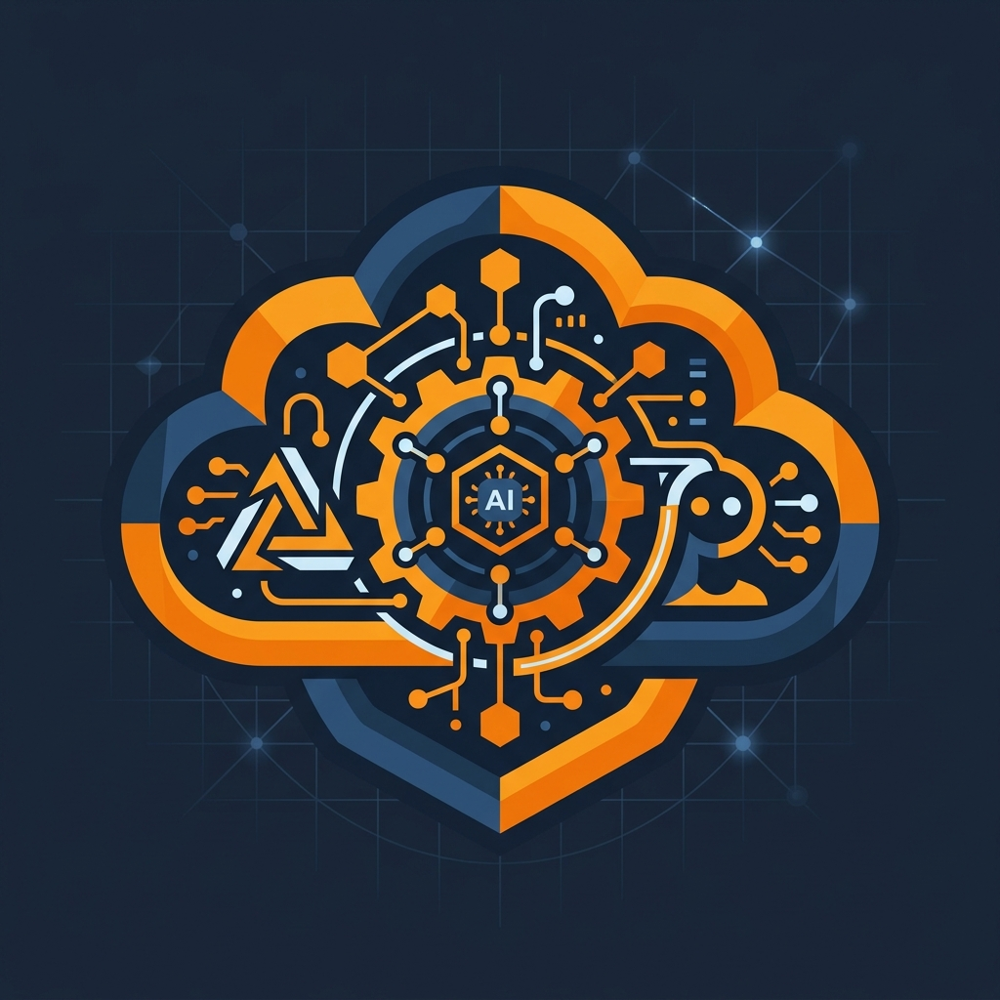
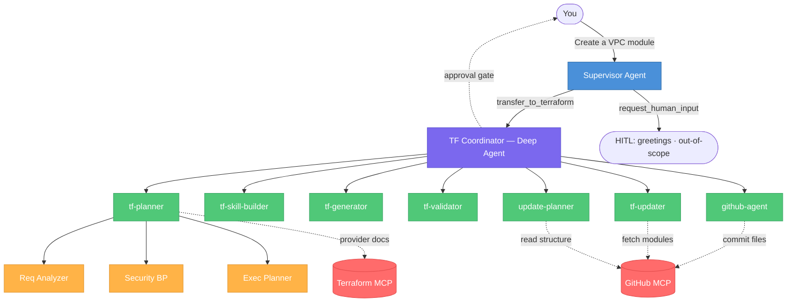

<p align="center">
  
</p>

<h1 align="center">AWS Orchestrator Agent</h1>

<p align="center">
  A multi-agent system that researches, generates, validates, and commits production-ready Terraform modules for AWS — through conversation.
</p>

<p align="center">
  <a href="https://github.com/talkops-ai/aws-orchestrator-agent/blob/main/LICENSE"></a>
  <a href="https://www.python.org/"></a>
  <a href="https://github.com/talkops-ai/aws-orchestrator-agent/stargazers"></a>
  <a href="https://discord.gg/RzqRy6uKAm"></a>
  <a href="https://github.com/talkops-ai/aws-orchestrator-agent/issues"></a>
</p>

<p align="center">
  <a href="#getting-started">Quick Start</a> · <a href="https://github.com/talkops-ai/aws-orchestrator-agent">Docs</a> · <a href="https://github.com/talkops-ai/aws-orchestrator-agent/issues/new?template=bug_report.md">Report Bug</a> · <a href="https://github.com/talkops-ai/aws-orchestrator-agent/issues/new?template=feature_request.md">Request Feature</a>
</p>

---

## Demo

<!-- TODO: Replace with an actual screen recording (GIF or MP4) showing the orchestrator in action -->
<p align="center">
  
</p>

> Generating a VPC module from a single prompt — planning, skill creation, code generation, validation, and GitHub commit — all through conversation.

---

## Why AWS Orchestrator?

**The problem.** Writing Terraform modules isn't the hard part. Writing them *well* is. Every new AWS service means reading through provider docs, figuring out CIS benchmarks, remembering your org's tagging conventions, setting up state backends, and wiring up outputs that downstream consumers actually need. Multiply that by every module your team maintains, and you've got a full-time job that isn't making your infrastructure better — it's just keeping it alive.

And when you do get it right, the knowledge lives in one person's head. The rest of the team copies from another module and hopes it works. When the provider updates, the same senior engineer rewrites everything from scratch.

**What AWS Orchestrator brings to the table.**

AWS Orchestrator doesn't just generate Terraform — it *researches* the service first. It queries the Terraform registry for the latest provider docs, analyzes security best practices, writes a skill blueprint, and *then* generates the code. The result is modules that are current, security-hardened, and follow your org's conventions — not stale copies from training data.

Three things make this different:

1. **It works like a senior infrastructure engineer, available to everyone.** A junior DevOps engineer using AWS Orchestrator gets access to the same depth — CIS benchmarks, provider-specific nuances, multi-AZ patterns, state backend design — that would normally take years to build up. It levels the playing field.

2. **It's a pipeline, not a prompt.** This isn't "paste a prompt, get some HCL back." It's a multi-stage pipeline: research → skill creation → code generation → sandbox validation → human approval → GitHub commit. Each stage is a separate agent that can fail, retry, or ask for help independently.

3. **Nothing ships without your sign-off.** Human-in-the-loop approval gates are mandatory — after validation and before every commit. The agent can't push to your repo without you explicitly saying "yes, this looks right." Governance is baked in, not bolted on.

---

## Key Features

**Available now:**

- **MCP-powered research** — queries Terraform Registry for latest provider versions, module patterns, and policy details instead of relying on stale training data
- **Skill-based generation** — creates per-service skill blueprints (SKILL.md + references) that guide code generation, preventing hallucinated provider configs
- **Complete module output** — generates `main.tf`, `variables.tf`, `outputs.tf`, `versions.tf`, `locals.tf`, `README.md`, plus service-specific files (`iam.tf`, `policies.tf`, `security_groups.tf`) as needed
- **Sandbox validation** — runs `terraform init`, `fmt -check`, and `validate` in a local sandbox before presenting results
- **Human-in-the-loop governance** — mandatory approval gates after validation and before GitHub commits; optional gates for ambiguous requirements and cost-sensitive architecture decisions
- **GitHub commit via MCP** — commits directly to your repo using GitHub MCP tools, no shell `git` commands
- **Module updates** — fetches existing modules from GitHub and applies targeted, surgical edits — not full rewrites
- **Persistent memory** — remembers your org's conventions, past failures, and module locations across sessions
- **Multi-provider LLM support** — Google Gemini, OpenAI, Anthropic, AWS Bedrock, Azure OpenAI
- **A2A + A2UI** — speaks the Google A2A protocol with rich interactive UI components for approval cards and deployment gates

**Coming soon:**

- **Multi-cloud support** — Azure and GCP module generation alongside AWS
- **Drift detection** — compare generated modules against deployed infrastructure
- **Cost estimation** — estimate infrastructure cost before commit
- **Custom policy engine** — plug in your org's compliance rules as validation gates

---

## Architecture

The system is a hierarchy of agents built with [LangGraph](https://github.com/langchain-ai/langgraph), communicating via the [A2A protocol](https://github.com/google/A2A).


```mermaid
graph TD
    User([You]) -->|"Create a VPC module"| S[Supervisor Agent]

    S -->|transfer_to_terraform| C[TF Coordinator — Deep Agent]
    S -->|request_human_input| H([HITL: greetings · out-of-scope])

    C --> P[tf-planner]
    C --> SB[tf-skill-builder]
    C --> G[tf-generator]
    C --> V[tf-validator]
    C --> UP[update-planner]
    C --> TU[tf-updater]
    C --> GA[github-agent]

    P --> RA[Req Analyzer]
    P --> SEC[Security BP]
    P --> EP[Exec Planner]

    P -.->|provider docs| TF_MCP[(Terraform MCP)]
    GA -.->|commit files| GH_MCP[(GitHub MCP)]
    TU -.->|fetch modules| GH_MCP
    UP -.->|read structure| GH_MCP

    C -.->|approval gate| User

    style S fill:#4A90D9,stroke:#2E6BA6,color:#fff
    style C fill:#7B68EE,stroke:#5A4FCF,color:#fff
    style P fill:#50C878,stroke:#3BA366,color:#fff
    style SB fill:#50C878,stroke:#3BA366,color:#fff
    style G fill:#50C878,stroke:#3BA366,color:#fff
    style V fill:#50C878,stroke:#3BA366,color:#fff
    style UP fill:#50C878,stroke:#3BA366,color:#fff
    style TU fill:#50C878,stroke:#3BA366,color:#fff
    style GA fill:#50C878,stroke:#3BA366,color:#fff
    style RA fill:#FFB347,stroke:#E09530,color:#fff
    style SEC fill:#FFB347,stroke:#E09530,color:#fff
    style EP fill:#FFB347,stroke:#E09530,color:#fff
    style TF_MCP fill:#FF6B6B,stroke:#E04A4A,color:#fff
    style GH_MCP fill:#FF6B6B,stroke:#E04A4A,color:#fff
```

**The flow in practice:**

1. You describe what you need (e.g. `"Create a VPC module with public and private subnets across 3 AZs"`)
2. **Supervisor** parses intent and delegates to the **TF Coordinator** deep agent
3. **tf-planner** researches the service via Terraform MCP → requirements analysis → security best practices → execution planning → skill writing
4. **tf-generator** reads the skill blueprint and writes every `.tf` file to a virtual filesystem
5. **tf-validator** runs `terraform init`, `fmt -check`, and `validate` in a sandbox
6. You get an approval card: *push to GitHub, or keep local?*
7. On approval, **github-agent** commits everything via GitHub MCP

---

## Table of Contents

- [Why AWS Orchestrator?](#why-aws-orchestrator)
- [Key Features](#key-features)
- [Architecture](#architecture)
- [Tech Stack](#tech-stack)
- [Getting Started](#getting-started)
- [Usage](#usage)
- [Agent Details](#agent-details)
- [Human-in-the-Loop](#human-in-the-loop--and-why-it-matters)
- [Skills and Memory](#skills-and-memory--how-the-agent-learns)
- [Project Structure](#project-structure)
- [Roadmap](#roadmap)
- [Contributing](#contributing)
- [FAQ](#faq)
- [License](#license)
- [Contact](#contact)
- [Acknowledgments](#acknowledgments)

---

## Tech Stack

| Category | Technologies |
|----------|-------------|
| **Agent Framework** | [LangChain](https://github.com/langchain-ai/langchain) + [LangGraph](https://github.com/langchain-ai/langgraph) + [deepagents](https://pypi.org/project/deepagents/) |
| **Language** | Python 3.12+ |
| **IaC Platform** | Terraform (AWS provider) |
| **LLM Providers** | Google Gemini · OpenAI · Anthropic · AWS Bedrock · Azure OpenAI |
| **Protocol** | [A2A](https://github.com/google/A2A) · [A2UI](https://a2ui.org) |
| **MCP Servers** | [Terraform Registry MCP](https://github.com/hashicorp/terraform-mcp-server) · [GitHub MCP](https://github.com/github/github-mcp-server) |
| **Validation** | Terraform CLI (`init`, `fmt`, `validate`) in sandbox |
| **Infrastructure** | Docker · [uv](https://github.com/astral-sh/uv) · [Uvicorn](https://www.uvicorn.org) · [Starlette](https://www.starlette.io) |

---

## Getting Started

### Prerequisites

- An LLM API key (Google Gemini, OpenAI, or Anthropic)
- [Docker](https://docs.docker.com/get-docker/) + Docker Compose (recommended)
- A [GitHub Personal Access Token](https://docs.github.com/en/authentication/keeping-your-account-and-data-secure/managing-your-personal-access-tokens) with `repo` scope (optional — for GitHub commit support)

### Installation

#### Quick Start with Docker Compose (recommended)

No cloning required. You just need two files: `docker-compose.yml` and `.env`.

**1. Create a `docker-compose.yml`** — copy from this repo's [`docker-compose.yml`](docker-compose.yml), or use:

```yaml
services:
  aws-orchestrator-agent:
    image: talkopsai/aws-orchestrator-agent:latest
    container_name: aws-orchestrator-agent
    ports:
      - "10104:10104"
    environment:
      - GOOGLE_API_KEY=${GOOGLE_API_KEY}
      - GITHUB_PERSONAL_ACCESS_TOKEN=${GITHUB_PERSONAL_ACCESS_TOKEN}
      - GITHUB_MCP_URL=https://api.githubcopilot.com/mcp
      - TERRAFORM_WORKSPACE=./workspace/terraform_modules
      - ENVIRONMENT=production
      # ── LLM: Standard tier (fast, cheap — validator + routing) ──
      - LLM_PROVIDER=google_genai
      - LLM_MODEL=gemini-3.1-flash-lite-preview
      - LLM_TEMPERATURE=0.0
      - LLM_MAX_TOKENS=15000
      # ── LLM: Higher tier (planner + supervisor) ──
      - LLM_HIGHER_PROVIDER=google_genai
      - LLM_HIGHER_MODEL=gemini-3.1-pro-preview
      # ── LLM: Deep Agent tier (coordinator + generator) ──
      - LLM_DEEPAGENT_PROVIDER=google_genai
      - LLM_DEEPAGENT_MODEL=gemini-3.1-pro-preview
      - LLM_DEEPAGENT_TEMPERATURE=1.0
      - LLM_DEEPAGENT_MAX_TOKENS=25000
      - LOG_LEVEL=INFO
    restart: unless-stopped
    networks:
      - aws-orchestrator-net

  talkops-ui:
    image: talkopsai/talkops:0.2.0
    container_name: talkops-ui
    ports:
      - "8080:80"
    depends_on:
      - aws-orchestrator-agent
    restart: unless-stopped
    networks:
      - aws-orchestrator-net

networks:
  aws-orchestrator-net:
    driver: bridge
```

**2. Create a `.env` file** in the same directory with your API keys:

```bash
GOOGLE_API_KEY=your_google_api_key_here
GITHUB_PERSONAL_ACCESS_TOKEN=your_github_pat_here
```

> **Using OpenAI or Anthropic instead?** Change the `LLM_PROVIDER` and `LLM_MODEL` values in the compose file. Replace `GOOGLE_API_KEY` with `OPENAI_API_KEY` or `ANTHROPIC_API_KEY` in your `.env`. See [`.env.example`](.env.example) for all supported providers.

**3. Start everything:**

```bash
docker compose up -d

# AWS Orchestrator running at http://localhost:10104
# TalkOps UI running at http://localhost:8080
```

That's it. Open **http://localhost:8080** and start talking to the orchestrator.

#### From Source

If you want to run it directly (for development or customization):

1. Install [uv](https://docs.astral.sh/uv/getting-started/installation/) for dependency management.

2. Clone the repo and create a virtual environment with Python 3.12:

```bash
git clone https://github.com/talkops-ai/aws-orchestrator-agent.git
cd aws-orchestrator-agent

uv venv --python=3.12
source .venv/bin/activate  # On Unix/macOS
# or
.venv\Scripts\activate  # On Windows
```

3. Install dependencies from `pyproject.toml`:

```bash
uv pip install -e .
```

4. Create a `.env` file and add your environment variables:

```bash
cp .env.example .env
# Edit .env — at minimum set your LLM API key
```

> All available configuration options can be found in [`aws_orchestrator_agent/config/default.py`](aws_orchestrator_agent/config/default.py). You can set any of these via your `.env` file.

5. Start the A2A server:

```bash
aws-orchestrator --host localhost --port 10104
```

To interact with the agent, we recommend using the **TalkOps UI** client. Pull and run it with Docker:

```bash
docker run -d \
  --name talkops-ui \
  -p 8080:80 \
  talkopsai/talkops:0.2.0
```

Then open [http://localhost:8080](http://localhost:8080) in your browser.

---

## Usage

### Basic

```
Create a VPC module with public and private subnets across 3 AZs
```

The system handles research, planning, skill creation, code generation, validation, and (optionally) GitHub commit. You approve the plan and the final output.

### With specific requirements

```
Generate Terraform for an S3 bucket with server-side encryption,
versioning, lifecycle rules, and cross-region replication to us-west-2.
```

### More examples

```
Create an EKS cluster module with managed node groups and IRSA
```

```
Update the VPC module on my-org/infra-modules to add a NAT gateway per AZ
```

```
Generate a Lambda function module with API Gateway trigger and DynamoDB access
```

---

## Agent Details

Each agent has a defined scope and its own set of tools.

### Supervisor Agent

Entry point. Routes requests — Terraform tasks go to the TF Coordinator, everything else gets handled directly (greetings, out-of-scope guidance).

**Tools:** `transfer_to_terraform`, `request_human_input`

### TF Coordinator (Deep Agent)

The brain. Orchestrates the full module lifecycle — decides which sub-agents to invoke and in what order. Manages virtual filesystem, skills, and memory. Reads HITL policies at session start.

**Tools:** `sync_workspace`, `request_user_input`

### tf-planner

Deep research pipeline. Runs a 3-phase flow: requirements analysis → security & best practices → execution planning. Queries the Terraform MCP server for latest provider docs and writes service-specific skill files so downstream agents don't hallucinate.

| Phase | What it does |
|-------|-------------|
| **Requirements Analyzer** | Extracts infrastructure requirements from the user's request |
| **Security & Best Practices** | Evaluates CIS benchmarks, encryption, access controls, tagging |
| **Execution Planner** | Creates detailed module specification with file set, variables, outputs |

### tf-generator

Reads the skill blueprint and writes every `.tf` file to the virtual filesystem. Follows the skill's declared file set exactly — no bundling everything into `main.tf`.

### tf-validator

Runs `terraform init -input=false`, `terraform fmt -check`, and `terraform validate` in a local sandbox. Returns `VALID` or `INVALID` with structured errors.

### tf-updater

Fetches existing modules from GitHub via MCP, applies targeted edits. Surgical changes, not full rewrites. Preserves existing formatting and conventions.

### update-planner

Reads an existing module on GitHub and produces a structured update plan. Does not modify files — analysis only. Flags breaking changes and dependency impacts.

### github-agent

Commits generated files to GitHub using MCP tools. Never uses shell `git` commands. For new files, commits directly; for existing files, fetches SHA first.

---

## Human-in-the-Loop — and why it matters

Infrastructure changes are irreversible. A bad `terraform apply` can take down production. So the agent doesn't just generate and commit — it pauses at critical gates and asks for your input.

### Mandatory gates

| Gate | When | What it asks |
|------|------|-------------|
| **Commit gate** | After validation passes | Push to GitHub or keep local? Which repo and branch? |
| **Next steps** | After task completion | Generate another module? Update an existing one? Done? |
| **Destructive ops** | Before deleting modules or force-pushing | Explicit human approval — never skipped |

### Optional gates (agent's discretion)

- **Ambiguous requirements** — "Create a VPC" → which region? How many AZs? Public/private?
- **Cost-sensitive decisions** — NAT gateway per AZ vs. shared, dedicated vs. shared tenancy

The full HITL policy lives in [`memory/hitl-policies.md`](memory/hitl-policies.md) and the coordinator reads it at the start of every session. If it discovers a new situation that should require human input, it updates the file — so the system gets smarter over time.

---

## Skills and Memory — how the agent learns

### Skills (`/skills/`)

Each AWS service gets its own skill directory:

```
skills/
├── tf-module-generator/         # General generation patterns
├── tf-module-updater/           # Update workflow rules
├── tf-module-validator/         # Validation workflow + error rules
├── tf-skill-builder/            # How to create new skills
├── github-committer/            # Commit workflow via MCP
└── update-planner/              # Module analysis patterns
```

When the planner runs, it queries the Terraform MCP server for the latest provider docs and writes service-specific skill files (SKILL.md + references). The generator reads these files and follows them exactly — which means it doesn't hallucinate provider version constraints or resource arguments.

If a skill already exists *and* its provider version is current, the planner is skipped entirely. This makes repeated generations for the same service significantly faster.

### Memory (`/memory/`)

The coordinator maintains persistent memory across sessions:

| File | Purpose |
|------|---------|
| `AGENTS.md` | Memory index — what files exist and reading rules |
| `hitl-policies.md` | When to pause and ask the human |
| `org-standards.md` | Your org's Terraform conventions (tags, naming, providers) |
| `module-index.md` | Where modules live in the GitHub repo |
| `failure-log.md` | Past validation failures — so it doesn't repeat mistakes |
| `learned-patterns.md` | Patterns to reuse across sessions |

---

## What you get

When the agent generates a module, you get a complete, production-ready directory:

```
workspace/terraform_modules/s3/
├── main.tf           # Core resources with security best practices
├── variables.tf      # Typed, validated, documented variables
├── outputs.tf        # All useful outputs with try() for conditionals
├── versions.tf       # Provider and Terraform version constraints
├── locals.tf         # Computed values and tag merging
└── README.md         # Usage example, inputs table, outputs table
```

Depending on the service, it might also generate `iam.tf`, `policies.tf`, `security_groups.tf`, `data.tf`, or `templates.tf` — the skill blueprint decides based on what the service actually needs.

Every module follows these conventions:
- **No hardcoded values** — regions, account IDs, and credentials are always variables
- **Provider version locking** — `>= x.y.z` constraints in `versions.tf`
- **Tag merging** — every resource gets `merge({"Name" = ...}, var.tags, var.<resource>_tags)`
- **Conditional resources** — `count` for simple on/off, `for_each` for collections
- **Safe outputs** — `try(resource[0].id, null)` for conditional resources

---

## Configuration

The agent uses a three-tier LLM configuration — different models for different jobs:

| Tier | Used by | Default | Why |
|------|---------|---------|-----|
| **Standard** | Validator, routing | `gemini-3.1-flash-lite-preview` | Fast and cheap for yes/no decisions |
| **Higher** | Planner, supervisor | `gemini-3.1-pro-preview` | Better reasoning for research and planning |
| **Deep Agent** | Coordinator, generator | `gemini-3.1-pro-preview` | Full capability for multi-step code generation |

> **Switching LLM providers:** Set `LLM_PROVIDER` (or `LLM_HIGHER_PROVIDER`, `LLM_DEEPAGENT_PROVIDER`) to `openai`, `anthropic`, `google_genai`, or `azure`. The system supports all of them out of the box.

For the full list of configuration options, see [`aws_orchestrator_agent/config/default.py`](aws_orchestrator_agent/config/default.py).

---

## Project Structure

```
aws-orchestrator-agent/
├── aws_orchestrator_agent/
│   ├── server.py                        # A2A server entry point (Uvicorn + Starlette)
│   ├── card/
│   │   └── aws_orchestrator_agent.json  # A2A agent card
│   ├── config/
│   │   ├── config.py                    # Config management (env → defaults → overrides)
│   │   └── default.py                   # Default values
│   ├── core/
│   │   ├── a2a_executor.py              # A2A task executor
│   │   └── agents/
│   │       ├── aws_orchestrator_supervisor.py  # Supervisor agent (router)
│   │       ├── types.py                 # BaseAgent, BaseDeepAgent, AgentResponse
│   │       └── tf_operator/
│   │           ├── tf_cordinator.py     # TF Coordinator (deep agent)
│   │           ├── subagents.py         # Sub-agent specs + JIT MCP wrappers
│   │           ├── middleware.py        # Deep agent middleware chain
│   │           ├── backends/            # Terraform-specific backends
│   │           ├── tools/               # Coordinator-level tools (sync, HITL)
│   │           ├── tf_planner/          # Planner supervisor sub-graph
│   │           ├── tf_generator/        # Generator utilities
│   │           ├── tf_validator/        # Validation utilities
│   │           └── tf_updater/          # Update utilities
│   └── utils/                           # Logger, LLM factory, MCP client
├── skills/                              # Service-specific skill directories
├── memory/                              # Persistent agent memory files
├── workspace/                           # Generated Terraform modules (output)
├── a2ui_extenstion/                     # TalkOps UI agent extension (A2UI)
├── docker-compose.yml                   # Full stack: Orchestrator + TalkOps UI
├── Dockerfile                           # Multi-stage build (Python 3.12 + Terraform CLI + MCP server)
├── pyproject.toml                       # Metadata, dependencies, build config
└── uv.lock                             # Locked dependencies
```

---

## Roadmap

**Phase 1 — Module Generation (shipped):**

- [x] Multi-agent Terraform module generation pipeline
- [x] MCP-powered research (Terraform Registry + GitHub)
- [x] Skill-based code generation with per-service blueprints
- [x] Sandbox validation (terraform init, fmt, validate)
- [x] Human-in-the-loop approval gates (commit gate, next steps, destructive ops)
- [x] GitHub commit via MCP tools
- [x] Module update workflow (fetch → plan → edit → validate → commit)
- [x] Persistent agent memory across sessions
- [x] A2A protocol + A2UI interactive components
- [x] Multi-provider LLM support (Gemini, OpenAI, Anthropic, Bedrock, Azure)
- [x] Docker deployment with TalkOps UI

**Phase 2 — Extended AWS Coverage (in progress):**

- [ ] Parallel module generation (multiple services in one request)
- [ ] Modify and update existing modules through conversation
- [ ] Expanded service skill library (EKS, RDS, Lambda, ALB, CloudFront, etc.)
- [ ] Terraform state backend auto-configuration
- [ ] Module dependency graph (outputs → inputs wiring across modules)

**Phase 3 — Operations & Governance:**

- [ ] Drift detection against deployed infrastructure
- [ ] Cost estimation before commit
- [ ] Custom compliance policy engine
- [ ] Terraform plan preview (dry-run before apply)

**Phase 4 — Infrastructure Intelligence:**

- [ ] Infrastructure knowledge base (best practices, common pitfalls, optimization)
- [ ] Module monitoring and version management
- [ ] Self-healing modules (auto-fix on provider updates)
- [ ] Custom agent plugin system

See [open issues](https://github.com/talkops-ai/aws-orchestrator-agent/issues) for the full list.

---

## Contributing

Contributions are welcome. The process is straightforward:

1. Fork the repo
2. Create a branch (`git checkout -b feature/your-feature`)
3. Make your changes and commit
4. Push and open a PR

If you're considering something bigger, open an issue first so we can align on the approach.

Please follow the existing code style (enforced by [Ruff](https://github.com/astral-sh/ruff)), add tests for new features, and make sure `pytest` passes before submitting.

---

## FAQ

<details>
<summary><b>Which AWS services does it support?</b></summary>

Any service supported by the AWS Terraform provider. It doesn't have a hardcoded list — the planner researches each service dynamically via the Terraform MCP server. VPC, S3, EC2, RDS, EKS, Lambda, IAM, CloudFront, etc. all work.
</details>

<details>
<summary><b>Which LLMs work?</b></summary>

Google Gemini, OpenAI, Anthropic, AWS Bedrock, and Azure OpenAI. Set <code>LLM_PROVIDER</code> and <code>LLM_MODEL</code> in your <code>.env</code>. The default config uses Gemini.
</details>

<details>
<summary><b>Will it commit code without asking?</b></summary>

No. Two mandatory approval gates: (1) after validation passes — push to GitHub or keep local, (2) after completion — generate another module or done. Destructive operations always require explicit approval, no exceptions.
</details>

<details>
<summary><b>Does it work with private GitHub repos?</b></summary>

Yes — your <code>GITHUB_PERSONAL_ACCESS_TOKEN</code> needs <code>repo</code> scope.
</details>

<details>
<summary><b>How does it avoid hallucinating provider configs?</b></summary>

The planner queries the Terraform Registry MCP server for the latest provider documentation before generating any code. It writes a skill blueprint with the exact resource arguments, variable types, and provider version constraints — the generator follows this blueprint, not its training data.
</details>

<details>
<summary><b>What if the generated module fails validation?</b></summary>

The coordinator re-dispatches the generator with the error details and re-runs validation. If it fails again after retry, it reports the errors and stops — it doesn't loop forever.
</details>

<details>
<summary><b>Does it need Terraform CLI installed?</b></summary>

For Docker: no. The Docker image includes Terraform CLI and the Terraform MCP server. For local development: yes, you need Terraform CLI installed on your machine.
</details>

<details>
<summary><b>How do I connect a client?</b></summary>

AWS Orchestrator speaks the <a href="https://github.com/google/A2A">A2A protocol</a>. Any A2A client works. The included <code>docker-compose.yml</code> ships with TalkOps UI at <code>localhost:8080</code>. You can also use the CLI client in <code>aws_orchestrator_client/</code>.
</details>

---

## License

Apache 2.0 — see [LICENSE](LICENSE).

---

## Contact

**TalkOps AI** — [github.com/talkops-ai](https://github.com/talkops-ai)

**Project:** [github.com/talkops-ai/aws-orchestrator-agent](https://github.com/talkops-ai/aws-orchestrator-agent)

**Discord:** [Join the community](https://discord.gg/RzqRy6uKAm)

---

## Acknowledgments

- [LangChain](https://github.com/langchain-ai/langchain) + [LangGraph](https://github.com/langchain-ai/langgraph) — agent orchestration
- [deepagents](https://pypi.org/project/deepagents/) — deep agent framework and middleware
- [Google A2A Protocol](https://github.com/google/A2A) — agent-to-agent communication
- [A2UI](https://a2ui.org) — interactive UI protocol
- [Terraform MCP Server](https://github.com/hashicorp/terraform-mcp-server) — real-time registry queries
- [GitHub MCP Server](https://github.com/github/github-mcp-server) — GitHub operations via MCP
- [uv](https://github.com/astral-sh/uv) — Python package management
