# AWS Orchestrator Agent

## 🚀 Enterprise-Grade Multi-Agent Terraform Module Generation System

A sophisticated, autonomous multi-agent system that generates enterprise-level AWS Terraform modules through intelligent research, analysis, and code generation. Built with LangGraph and advanced AI orchestration patterns for production-ready infrastructure automation.

## 🏗️ Architecture Overview

### Complete Multi-Agent Ecosystem

```mermaid
graph TD
    %% User Interface
    U["👤 User Request<br/>\"Help me create an enterprise S3 module\""] --> S["🎯 Main Supervisor Agent<br/>Orchestrates autonomous research & generation"]
    
    %% Main Supervisor
    S --> P["📋 Planner Sub-Supervisor<br/>Deep research & enterprise-grade execution plans"]
    S --> G["🏭 Generator Swarm<br/>Autonomous code generation using 7 specialized agents"]
    S --> W["📝 Writer React Agent<br/>Writes enterprise modules to filesystem"]
    S --> V["✅ Validation Agent<br/>Enterprise-grade validation & compliance"]
    
    %% Planner Sub-Agents
    subgraph PlannerAgents ["📋 Planner Sub-Supervisor Agents"]
        RA["🔍 Requirements Analyzer<br/>Extracts infrastructure requirements"]
        EP["📊 Execution Planner<br/>Creates detailed execution plans"]
        SP["🔒 Security & Best Practices<br/>Evaluates security & compliance"]
    end
    
    %% Generator Swarm Agents
    subgraph GeneratorAgents ["🏭 Generator Swarm Agents"]
        RC["🏗️ Resource Configuration<br/>Generates Terraform resources"]
        VD["📝 Variable Definition<br/>Creates variable definitions"]
        DS["🔍 Data Source<br/>Generates data source blocks"]
        LV["💾 Local Values<br/>Creates local value blocks"]
        OD["📤 Output Definition<br/>Generates output definitions"]
        BG["🗄️ Backend Generator<br/>Creates backend configuration"]
        RG["📚 README Generator<br/>Generates documentation"]
    end
    
    %% Writer Tools
    subgraph WriterTools ["📝 Writer React Agent Tools"]
        WF["📄 Write Files<br/>Writes Terraform files to disk"]
        BF["📦 Batch Write<br/>Efficient batch file operations"]
        VF["✅ Validate Syntax<br/>Validates HCL before writing"]
        CF["📁 Create Directories<br/>Manages directory structure"]
    end
    
    %% Data Flow
    P --> RA
    P --> EP
    P --> SP
    RA --> EP
    EP --> SP
    
    G --> RC
    RC --> VD
    RC --> DS
    RC --> LV
    RC --> OD
    VD --> BG
    DS --> BG
    LV --> BG
    OD --> BG
    BG --> RG
    
    W --> WF
    W --> BF
    W --> VF
    W --> CF
    
    %% Return Flow
    P --> S
    G --> S
    W --> S
    V --> S
    S --> U

    %% Human-in-the-Loop
    subgraph HumanLoop ["🔄 Human-in-the-Loop"]
        H["👤 User Clarification<br/>Interactive requirements gathering"]
    end
    
    S -.->|"Clarification needed"| H
    H -.->|"Refined requirements"| S
    
    %% Styling
    classDef user fill:#e1f5fe
    classDef supervisor fill:#f3e5f5
    classDef planner fill:#e8f5e8
    classDef generator fill:#fff3e0
    classDef writer fill:#fce4ec
    classDef validation fill:#f0f4c3
    classDef human fill:#ffebee
    
    class U user
    class S supervisor
    class P,RA,EP,SP planner
    class G,RC,VD,DS,LV,OD,BG,RG generator
    class W,WF,BF,VF,CF writer
    class V validation
    class H human
```



## 🔗 A2A Protocol Integration

### Enterprise Agent-to-Agent Communication

The AWS Orchestrator Agent is designed as a **first-class A2A (Agent-to-Agent) protocol agent**, enabling seamless integration with enterprise agent ecosystems and multi-agent coordination.

#### A2A Architecture Integration


#### Key A2A Components

1. **🔗 A2A Executor Integration**: `AWSOrchestratorAgentExecutor` implements the A2A protocol
2. **🔄 Supervisor Agent Adapter**: Bridges LangGraph-based Supervisor with A2A protocol
3. **🌐 A2A Server Integration**: Deployable as an A2A agent server
4. **📊 State Management**: Enterprise-grade workflow state tracking across agent boundaries

#### A2A Server Deployment

```bash
# Development A2A Server (using uv)
uv run --active aws-orchestrator-agent \
  --host localhost \
  --port 10102 \
  --agent-card aws_orchestrator_agent/card/aws_orchestrator_agent.json

# Production A2A Server
aws-orchestrator-agent \
  --host 0.0.0.0 \
  --port 8000 \
  --agent-card aws_orchestrator_agent/card/aws_orchestrator_agent.json \
  --config-file config.yaml
```

#### Programmatic A2A Server Setup
```python
# A2A Server Setup
from aws_orchestrator_agent.server import main

# Start A2A server
main(
    host="0.0.0.0",
    port=8000,
    agent_card="aws_orchestrator_agent/card/aws_orchestrator_agent.json",
    config_file="config.yaml"
)
```

#### Enterprise Agent Ecosystem Benefits

- **🔄 Multi-Agent Coordination**: Seamless integration with other specialized agents
- **📊 Enterprise State Management**: Robust state orchestration across agent boundaries
- **🛡️ Protocol Compliance**: Full A2A protocol compliance for enterprise environments
- **📈 Scalability**: Multiple concurrent workflows with resource management
- **🔍 Observability**: Complete workflow visibility and progress tracking

## 🎯 Core Components

### 1. 🎯 Main Supervisor Agent (`CustomSupervisorAgent`)

**The Autonomous Orchestrator** - Manages the entire enterprise-grade workflow lifecycle using `langgraph-supervisor`.

#### Key Features:
- **🔄 Autonomous Workflow Orchestration**: Coordinates all sub-agents through intelligent routing
- **📊 Comprehensive State Management**: Maintains detailed workflow state across all phases
- **🛡️ Enterprise-Grade Error Handling**: Robust error recovery and retry mechanisms
- **👤 Human-in-the-Loop**: Interactive clarification for complex requirements
- **📈 Real-Time Progress Tracking**: Live workflow progress monitoring and reporting
- **🔀 Intelligent Agent Routing**: Smart task delegation based on enterprise requirements
- **⏱️ Time-Intensive Processing**: Designed for thorough, high-quality module generation

#### Autonomous Workflow Phases:
1. **📋 Deep Research Phase**: Delegates to Planner Sub-Supervisor for comprehensive analysis
2. **🏭 Autonomous Generation Phase**: Delegates to Generator Swarm for enterprise-grade code generation
3. **📝 Enterprise Writing Phase**: Delegates to Writer React Agent for production-ready file creation
4. **✅ Enterprise Validation Phase**: Comprehensive validation and compliance checking

### 2. 📋 Planner Sub-Supervisor Agent

**The Enterprise Research Engine** - Conducts deep research and analysis to create comprehensive execution plans.

#### Sub-Agents:
- **🔍 Requirements Analyzer**: Deep analysis of enterprise infrastructure requirements
- **📊 Execution Planner**: Creates detailed enterprise-grade execution plans with comprehensive resource configurations
- **🔒 Security & Best Practices Evaluator**: Ensures enterprise security standards and compliance (optional)

#### Enterprise Output:
- **Comprehensive Requirements Data**: Detailed enterprise infrastructure requirements
- **Enterprise Execution Plans**: Production-ready Terraform module specifications
- **Advanced Resource Configurations**: Complete enterprise resource definitions with best practices
- **Enterprise Variable Definitions**: Comprehensive input variable specifications
- **Enterprise Module Structure**: Production-ready file organization and architecture

### 3. 🏭 Generator Swarm Agent

**The Autonomous Enterprise Code Generation Engine** - Uses 7 specialized agents to generate enterprise-grade Terraform modules through sophisticated coordination.

#### Specialized Agents:
1. **🏗️ Resource Configuration Agent**: Generates enterprise-grade Terraform resource blocks with best practices
2. **📝 Variable Definition Agent**: Creates comprehensive variable definitions with validation
3. **🔍 Data Source Agent**: Generates advanced data source blocks for enterprise patterns
4. **💾 Local Values Agent**: Creates sophisticated local value blocks for complex logic
5. **📤 Output Definition Agent**: Generates enterprise output definitions with proper documentation
6. **🗄️ Backend Generator Agent**: Creates production-ready backend configuration
7. **📚 README Generator Agent**: Generates comprehensive enterprise documentation

#### Enterprise Features:
- **🔄 Sophisticated Dependency-Aware Handoffs**: Advanced inter-agent coordination for enterprise patterns
- **📊 Isolated State Management**: Separate state schemas for each agent to prevent conflicts
- **🎯 Priority-Based Enterprise Routing**: Handoffs based on enterprise dependency priority
- **🛡️ Enterprise Error Recovery**: Individual agent error handling with enterprise-grade continuation
- **📈 Real-Time Enterprise Progress Tracking**: Live generation progress monitoring for enterprise workflows
- **⏱️ Time-Intensive Processing**: Designed for thorough, high-quality enterprise module generation

### 4. 📝 Writer React Agent

**The Enterprise File System Manager** - Writes enterprise-grade Terraform modules to the filesystem with production-ready organization.

#### Enterprise Tools:
- **📄 Enterprise File Writing**: Individual file writing with enterprise validation
- **📦 Batch Enterprise Operations**: Efficient batch file operations for enterprise modules
- **✅ Enterprise Syntax Validation**: HCL syntax validation with enterprise best practices
- **📁 Enterprise Directory Management**: Production-ready directory structure management
- **📋 Enterprise File Management**: Advanced directory listing and file management
- **📖 Enterprise File Analysis**: Comprehensive file content reading and analysis

#### Enterprise Features:
- **🔄 Enterprise React Agent Pattern**: Tool-based execution with enterprise state injection
- **📊 Enterprise Operation Tracking**: Detailed file operation logging for enterprise workflows
- **🛡️ Enterprise Error Handling**: Individual file error handling with enterprise-grade continuation
- **💾 Enterprise Backup Support**: Automatic backup creation for enterprise file operations
- **📈 Enterprise Progress Monitoring**: Real-time writing progress tracking for enterprise modules

### 5. ✅ Validation Agent

**The Enterprise Quality Assurance** - Validates generated Terraform modules for enterprise-grade correctness and best practices.

#### Enterprise Features:
- **🔍 Enterprise Syntax Validation**: Comprehensive HCL syntax checking with enterprise standards
- **📋 Enterprise Best Practices**: AWS and Terraform enterprise best practices validation
- **🔒 Enterprise Security Scanning**: Advanced security vulnerability detection and compliance
- **📊 Enterprise Resource Validation**: Comprehensive resource configuration validation
- **🎯 Enterprise Compliance Checking**: Regulatory compliance verification for enterprise environments

## 🔄 Complete Workflow Example

### Enterprise S3 Module Generation Flow


## 🚀 Enterprise Benefits

### 1. **🎯 Autonomous Enterprise Orchestration**
- **Intelligent Enterprise Routing**: Automatic task delegation based on enterprise requirements
- **Comprehensive Workflow Management**: Enterprise-grade workflow state tracking
- **Enterprise Error Recovery**: Robust error handling and retry mechanisms for enterprise environments
- **Real-Time Enterprise Monitoring**: Live progress tracking and reporting for enterprise workflows
- **⏱️ Time-Intensive Processing**: Designed for thorough, high-quality enterprise module generation

### 2. **🔗 A2A Protocol Integration Benefits**
- **🌐 Enterprise Agent Ecosystem**: Seamless integration with other specialized agents
- **📊 Multi-Agent Coordination**: Coordinate with security, compliance, and monitoring agents
- **🔄 Protocol Compliance**: Full A2A protocol compliance for enterprise environments
- **📈 Scalable Architecture**: Multiple concurrent workflows with enterprise resource management
- **🛡️ Enterprise State Management**: Robust state orchestration across agent boundaries

### 3. **🏗️ Enterprise Modular Architecture**
- **Enterprise Agent Specialization**: Each agent has a specific, well-defined enterprise role
- **Enterprise State Isolation**: Separate state schemas prevent conflicts in enterprise environments
- **Enterprise Tool Integration**: Sophisticated tool-based execution for enterprise patterns
- **Enterprise Extensibility**: Easy to add new agents and capabilities for enterprise needs

### 4. **🔄 Advanced Enterprise Coordination**
- **Enterprise Dependency Management**: Sophisticated dependency resolution for enterprise patterns
- **Enterprise Handoff Mechanisms**: Intelligent agent-to-agent communication for enterprise workflows
- **Enterprise State Transformation**: Seamless state conversion between enterprise agents
- **Enterprise Completion Detection**: Automatic completion detection and reporting for enterprise modules

### 5. **🛡️ Enterprise Production-Ready Features**
- **Enterprise Error Handling**: Comprehensive error handling at all levels for enterprise environments
- **Enterprise Logging**: Structured logging throughout the system for enterprise monitoring
- **Enterprise Monitoring**: Real-time monitoring and observability for enterprise operations
- **Enterprise Human-in-the-Loop**: Interactive clarification and approval workflows for complex enterprise requirements

### 6. **📊 Enterprise-Grade Output**
- **Complete Enterprise Modules**: Full Terraform modules with all necessary enterprise files
- **Enterprise Documentation**: Comprehensive README and inline documentation for enterprise use
- **Enterprise Validation**: Built-in syntax and enterprise best practices validation
- **Enterprise File Management**: Organized file structure and naming conventions for enterprise environments

## 🛠️ Enterprise Technical Architecture

### Enterprise State Management
- **SupervisorState**: Main enterprise workflow state with comprehensive tracking
- **PlannerSupervisorState**: Enterprise planning-specific state with sub-agent coordination
- **GeneratorSwarmState**: Enterprise generation-specific state with dependency management
- **WriterReactState**: Enterprise writing-specific state with operation tracking

### Enterprise Handoff Mechanisms
- **LangGraph Supervisor**: Advanced enterprise agent orchestration using `langgraph-supervisor`
- **Enterprise Custom Handoff Tools**: Specialized tools for enterprise agent-to-agent communication
- **Enterprise State Transformation**: Seamless state conversion between different enterprise schemas
- **Enterprise Dependency Resolution**: Sophisticated dependency tracking and resolution for enterprise patterns

### Enterprise Error Handling
- **Multi-Level Enterprise Error Handling**: Error handling at supervisor, agent, and tool levels for enterprise environments
- **Enterprise Graceful Degradation**: Continue processing despite individual failures in enterprise workflows
- **Enterprise Retry Mechanisms**: Automatic retry with exponential backoff for enterprise operations
- **Enterprise Error Reporting**: Comprehensive error logging and reporting for enterprise monitoring

## 📈 Enterprise Performance & Scalability

### Enterprise Optimization Features
- **Enterprise Batch Operations**: Efficient batch file writing and processing for enterprise modules
- **Enterprise State Isolation**: Prevents state conflicts between agents in enterprise environments
- **Enterprise Async Processing**: Asynchronous agent execution for better enterprise performance
- **Enterprise Memory Management**: Efficient memory usage with proper cleanup for enterprise workflows
- **⏱️ Time-Intensive Processing**: Designed for thorough, high-quality enterprise module generation (5-15 minutes per module)

### Enterprise Monitoring & Observability
- **Enterprise Structured Logging**: Comprehensive logging with structured data for enterprise monitoring
- **Enterprise Progress Tracking**: Real-time progress monitoring for enterprise workflows
- **Enterprise Performance Metrics**: Detailed performance metrics and analytics for enterprise operations
- **Enterprise Error Tracking**: Comprehensive error tracking and analysis for enterprise environments

## 🔧 Configuration & Customization

### LLM Configuration
- **Multi-Provider Support**: Support for multiple LLM providers (Anthropic, OpenAI, Azure, etc.)
- **Model Selection**: Configurable model selection per agent
- **Parameter Tuning**: Adjustable temperature, max tokens, and other parameters
- **Provider Switching**: Easy switching between different LLM providers

### Agent Configuration
- **Custom Prompts**: Configurable prompts for each agent
- **Tool Selection**: Selective tool enabling/disabling
- **Workflow Customization**: Customizable workflow phases and routing
- **Error Handling**: Configurable error handling and retry policies

## 🎯 Enterprise Use Cases

### 1. **🏗️ Enterprise Infrastructure as Code**
- Generate complete enterprise-grade Terraform modules for AWS services
- Create standardized, reusable enterprise infrastructure components
- Ensure enterprise best practices and security compliance
- Automate enterprise infrastructure provisioning workflows
- **⏱️ Time-Intensive**: 5-15 minutes per enterprise module for thorough analysis and generation

### 2. **🔄 Enterprise DevOps Automation**
- Integrate with enterprise CI/CD pipelines
- Automate enterprise infrastructure testing and validation
- Streamline enterprise deployment processes
- Reduce manual enterprise infrastructure management
- **Autonomous Processing**: Fully autonomous enterprise module generation with minimal human intervention

### 3. **📚 Enterprise Knowledge Management**
- Create comprehensive enterprise documentation
- Maintain enterprise infrastructure knowledge bases
- Standardize enterprise infrastructure patterns
- Enable enterprise knowledge sharing across teams
- **Research-Driven**: Deep research and analysis for enterprise-grade solutions

### 4. **🛡️ Enterprise Security & Compliance**
- Ensure enterprise security best practices
- Validate enterprise compliance requirements
- Automate enterprise security scanning
- Maintain enterprise audit trails
- **Enterprise-Grade Security**: Comprehensive security analysis and validation for enterprise environments

## 🚀 Getting Started

### Prerequisites
- Python 3.12+
- Terraform CLI
- AWS CLI (for deployment)
- Required Python packages (see pyproject.toml)
- **⏱️ Time Allocation**: Allow 5-15 minutes per enterprise module generation

### Installation

#### Option 1: Standalone Installation
```bash
# Clone the repository
git clone <repository-url>
cd aws-orchestrator-agent

# Install dependencies
pip install -e .

# Configure environment variables
cp .env.example .env
# Edit .env with your configuration

# Run standalone
python -m aws_orchestrator_agent.main
```

#### Option 2: A2A Agent Server Deployment
```bash
# Install dependencies
pip install -e .

# Start A2A server with agent card
uv run --active aws-orchestrator-agent \
  --host localhost \
  --port 10102 \
  --agent-card aws_orchestrator_agent/card/aws_orchestrator_agent.json
```


#### Option 3: Docker Deployment
```bash
# Build Docker image
docker build -t aws-orchestrator-agent .

# Run as A2A agent server
docker run -p 8000:8000 \
  -e OPENAI_API_KEY=your_key \
  -e ANTHROPIC_API_KEY=your_key \
  aws-orchestrator-agent
```

### Enterprise Usage

#### Standalone Usage
```python
from aws_orchestrator_agent.core.agents.supervisor_agent import create_supervisor_agent

# Create enterprise supervisor with all agents
supervisor = create_supervisor_agent(
    agents=[planner_agent, generator_agent, writer_agent, validation_agent],
    config=config
)

# Process enterprise user request
# ⏱️ This will take 5-15 minutes for enterprise-grade modules
async for response in supervisor.stream("Create an enterprise S3 bucket module with advanced security and compliance features", context_id, task_id):
    print(response.content)
```

#### A2A Agent Integration
```python
from a2a.server import AgentServer
from a2a.server.request_handlers import DefaultRequestHandler
from aws_orchestrator_agent.core import GenericAgentExecutor
from aws_orchestrator_agent.core.agents.supervisor_agent import create_supervisor_agent

# Create supervisor agent
supervisor_agent = create_supervisor_agent(config=config)

# Create A2A executor
executor = GenericAgentExecutor(agent=supervisor_agent)

# Create A2A server
server = AgentServer()
server.register_agent(
    name="aws-orchestrator-supervisor",
    handler=DefaultRequestHandler(agent_executor=executor),
    agent_card={
        "name": "AWS Orchestrator Supervisor",
        "description": "Intelligent AWS infrastructure orchestration with multi-agent coordination",
        "capabilities": [
            "terraform_generation",
            "infrastructure_analysis", 
            "security_validation",
            "compliance_checking",
            "cost_optimization"
        ]
    }
)

# Start A2A server
server.start(host="0.0.0.0", port=8000)
```

#### A2A Request Example
```json
{
    "method": "run_task",
    "params": {
        "query": "Create a VPC with subnets and security groups",
        "context_id": "ctx-123",
        "task_id": "task-456"
    }
}
```

## 📚 Documentation

### Comprehensive Documentation
- **[Planner Sub-Supervisor Documentation](docs/PLANNER_SUB_SUPERVISOR_DOCUMENTATION.md)**: Detailed planner agent architecture
- **[Generator Swarm Documentation](docs/GENERATOR_SWARM_AGENT_DOCUMENTATION.md)**: Complete generator swarm analysis
- **[Writer React Agent Documentation](docs/WRITER_REACT_AGENT_DOCUMENTATION.md)**: File writing agent details
- **[Supervisor Agent Architecture](docs/supervisor-agent-architecture.md)**: Main supervisor architecture
- **[Agent Architecture Overview](docs/agent-architecture.md)**: General agent architecture

### API Reference
- **Agent APIs**: Complete API documentation for all agents
- **State Models**: Detailed state schema documentation
- **Tool Reference**: Comprehensive tool documentation
- **Configuration Guide**: Complete configuration reference

## 🤝 Contributing

We welcome contributions! Please see our [Contributing Guide](CONTRIBUTING.md) for details.

### Development Setup
```bash
# Install development dependencies
pip install -r requirements-dev.txt

# Run tests
pytest

# Run linting
flake8

# Run type checking
mypy
```

## 📄 License

This project is licensed under the Apache License 2.0 - see the [LICENSE](LICENSE) file for details.

## 🙏 Acknowledgments

- **LangGraph**: For the powerful agent orchestration framework
- **LangChain**: For the comprehensive LLM integration tools
- **AWS**: For the robust cloud infrastructure platform
- **Terraform**: For the infrastructure as code capabilities

---

**Built with ❤️ for the DevOps and Infrastructure community**
