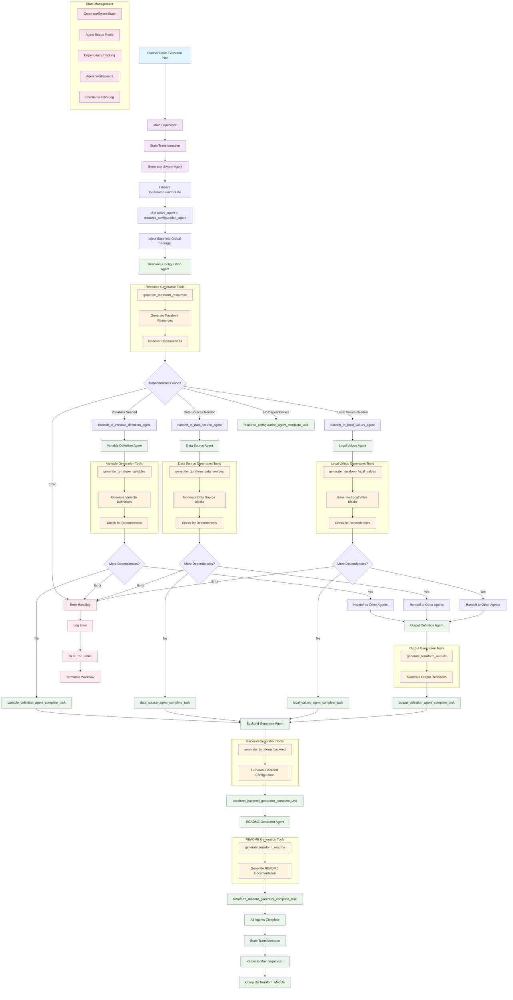
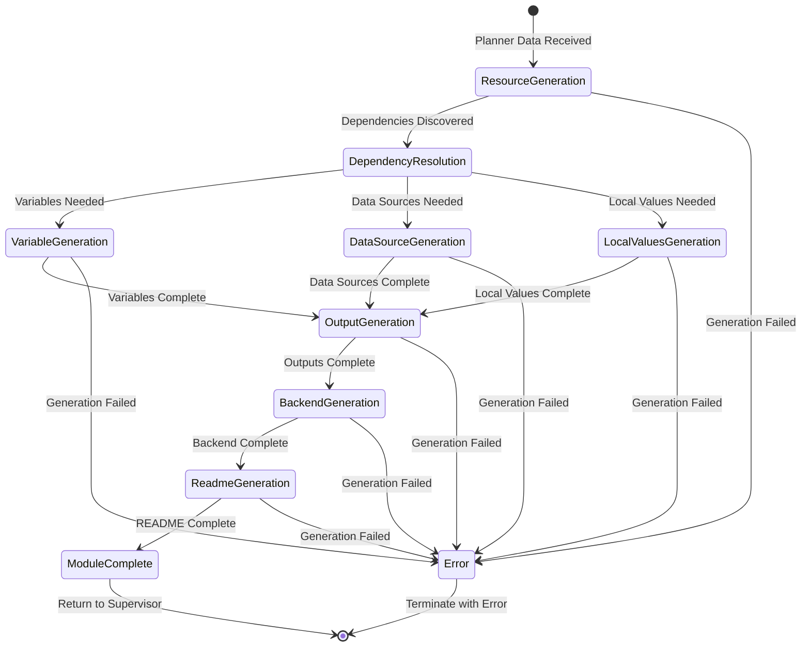
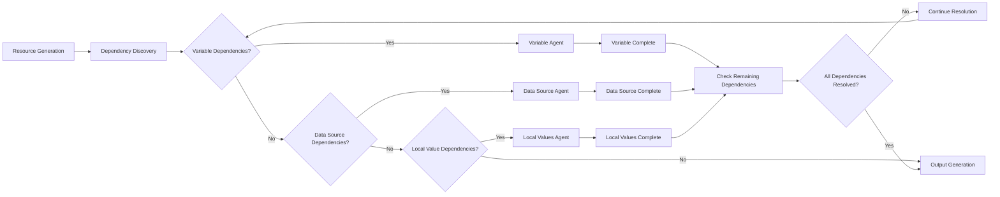
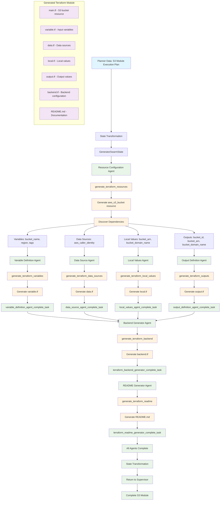

# Generator Swarm Agent - Comprehensive Documentation

## Table of Contents
1. [Overview](#overview)
2. [Architecture](#architecture)
3. [Core Components](#core-components)
4. [Sub-Agents](#sub-agents)
5. [State Management](#state-management)
6. [Handoff Mechanisms](#handoff-mechanisms)
7. [Workflow Process](#workflow-process)
8. [Complete Flow Diagram](#complete-flow-diagram)
9. [Configuration](#configuration)
10. [Error Handling](#error-handling)
11. [Integration Points](#integration-points)
12. [API Reference](#api-reference)

## Overview

The **Generator Swarm Agent** is a sophisticated multi-agent system that generates complete Terraform modules using a swarm of specialized agents. It uses `langgraph-swarm` to coordinate between 7 specialized agents that work together to create comprehensive Terraform infrastructure code.

### Key Responsibilities
- **Terraform Module Generation**: Creates complete Terraform modules with all necessary components
- **Agent Coordination**: Manages 7 specialized agents using swarm architecture
- **Dependency Resolution**: Handles complex dependencies between Terraform components
- **State Management**: Maintains isolated state with transformation to/from supervisor
- **Quality Assurance**: Ensures generated code follows Terraform best practices

### Core Functionality
- Generates Terraform resources, variables, data sources, locals, outputs, backend, and README
- Coordinates agent handoffs based on discovered dependencies
- Manages complex dependency resolution between agents
- Provides comprehensive Terraform module generation
- Handles state transformation between supervisor and swarm

## Architecture

### High-Level Architecture

```
┌─────────────────────────────────────────────────────────────┐
│                    Main Supervisor                          │
│  ┌─────────────────────────────────────────────────────┐    │
│  │            Generator Swarm Agent                   │    │
│  │  ┌─────────────┐ ┌─────────────┐ ┌─────────────┐  │    │
│  │  │ Resource    │ │ Variable    │ │ Data Source │  │    │
│  │  │ Agent       │ │ Agent       │ │ Agent       │  │    │
│  │  └─────────────┘ └─────────────┘ └─────────────┘  │    │
│  │  ┌─────────────┐ ┌─────────────┐ ┌─────────────┐  │    │
│  │  │ Local       │ │ Output      │ │ Backend     │  │    │
│  │  │ Values      │ │ Agent       │ │ Agent       │  │    │
│  │  │ Agent       │ │             │ │             │  │    │
│  │  └─────────────┘ └─────────────┘ └─────────────┘  │    │
│  │  ┌─────────────────────────────────────────────┐  │    │
│  │  │           README Agent                      │  │    │
│  │  └─────────────────────────────────────────────┘  │    │
│  │                                                     │    │
│  │  ┌─────────────────────────────────────────────────┐  │    │
│  │  │           State Management System               │  │    │
│  │  └─────────────────────────────────────────────────┘  │    │
│  └─────────────────────────────────────────────────────┘    │
└─────────────────────────────────────────────────────────────┘
```

### Component Relationships

The generator swarm uses the **langgraph-swarm** library to create a sophisticated agent coordination system with:

- **Swarm Coordinator**: Manages agent transitions and dependencies
- **7 Specialized Agents**: Each focused on specific Terraform components
- **Handoff Tools**: Sophisticated dependency-aware handoff mechanisms
- **State Isolation**: Separate state schema with transformation functions
- **Dependency Resolution**: Complex dependency tracking and resolution

## Core Components

### 1. GeneratorSwarmAgent

The main swarm coordinator that orchestrates the generation workflow.

**Key Features:**
- Inherits from `BaseSubgraphAgent`
- Uses `langgraph-swarm` for agent coordination
- Implements sophisticated handoff management
- Manages isolated state with transformation
- Provides comprehensive logging and error handling

**Initialization Process:**
1. **Configuration Setup**: Loads LLM configuration and settings
2. **Manager Initialization**: Creates specialized managers for coordination
3. **Agent Creation**: Initializes 7 specialized generation agents
4. **Swarm Building**: Constructs the swarm with dependency resolution
5. **State Transformation**: Handles state conversion to/from supervisor

### 2. State Management System

#### GeneratorSwarmState
The isolated state model that tracks the entire generation workflow:

```python
class GeneratorSwarmState(TypedDict):
    # Agent coordination
    active_agent: str
    agent_status_matrix: Dict[str, GeneratorAgentStatus]
    
    # Message handling
    llm_input_messages: Annotated[List[AnyMessage], add_messages]
    messages: Annotated[List[AnyMessage], add_messages]
    
    # Stage management
    stage_status: str
    planning_progress: Dict[str, float]
    
    # Dependency tracking
    pending_dependencies: Dict[str, List[Dict[str, Any]]]
    resolved_dependencies: Dict[str, List[Dict[str, Any]]]
    dependency_graph: Dict[str, Set[str]]
    
    # Agent workspaces
    agent_workspaces: Dict[str, Dict[str, Any]]
    
    # Planning data
    execution_plan_data: Optional[Dict[str, Any]]
    state_management_plan_data: Optional[Dict[str, Any]]
    configuration_optimizer_plan_data: Optional[Dict[str, Any]]
    
    # Communication
    handoff_queue: List[Dict[str, Any]]
    communication_log: List[Dict[str, Any]]
    
    # Checkpointing and HITL
    checkpoint_metadata: Dict[str, Any]
    approval_required: bool
```

#### GeneratorAgentStatus
Tracks individual agent states:

```python
class GeneratorAgentStatus(Enum):
    INACTIVE = "inactive"
    ACTIVE = "active"  
    WAITING = "waiting"
    COMPLETED = "completed"
    ERROR = "error"
```

### 3. Handoff Management System

#### GeneratorStageHandoffManager
Sophisticated handoff system with dependency resolution:

- **Dependency-Aware Handoffs**: Tools that understand agent dependencies
- **Priority-Based Routing**: Handoffs based on dependency priority
- **Context Preservation**: Maintains full context across handoffs
- **State Updates**: Atomic state updates during handoffs

#### Dependency Types
Comprehensive dependency tracking:

```python
class DependencyType(Enum):
    RESOURCE_TO_VARIABLE = "resource_to_variable"
    RESOURCE_TO_DATA_SOURCE = "resource_to_data_source"
    RESOURCE_TO_LOCAL_VALUES = "resource_to_local_values"
    RESOURCE_TO_OUTPUT = "resource_to_output"
    VARIABLE_TO_RESOURCE = "variable_to_resource"
    # ... and many more bidirectional dependencies
```

## Sub-Agents

### 1. Resource Configuration Agent

**Purpose**: Generates Terraform resource blocks for AWS services

**Key Tools:**
- **`generate_terraform_resources`**: Main resource generation tool
- **Handoff Tools**: Dependency-aware handoffs to other agents
- **Completion Tool**: Marks task completion and triggers next agent

**Workflow:**
1. **Analyze Execution Plan**: Extract resource requirements
2. **Generate Resources**: Create Terraform resource blocks
3. **Dependency Detection**: Identify variables, data sources, locals needed
4. **Handoff Coordination**: Route dependencies to appropriate agents
5. **Completion**: Mark task complete when all dependencies resolved

**Output Schema:**
```python
class TerraformResourceBlock(BaseModel):
    resource_type: Union[ResourceBlockType, str]
    resource_name: str
    logical_name: str
    configuration_attributes: Dict[str, Any]
    required_attributes: List[str]
    optional_attributes: List[str]
    meta_arguments: Dict[str, Any]
    lifecycle_configuration: Optional[Dict[str, Any]]
    implicit_dependencies: List[str]
    explicit_dependencies: List[str]
```

### 2. Variable Definition Agent

**Purpose**: Generates Terraform variable definitions

**Key Tools:**
- **`generate_terraform_variables`**: Main variable generation tool
- **Handoff Tools**: Coordinate with other agents for dependencies
- **Completion Tool**: Marks variable generation complete

**Workflow:**
1. **Analyze Dependencies**: Identify variables needed by resources
2. **Generate Variables**: Create comprehensive variable definitions
3. **Dependency Resolution**: Handle variable-to-resource dependencies
4. **Handoff Coordination**: Route remaining dependencies
5. **Completion**: Mark task complete

### 3. Data Source Agent

**Purpose**: Generates Terraform data source blocks

**Key Tools:**
- **`generate_terraform_data_sources`**: Main data source generation tool
- **Handoff Tools**: Coordinate with other agents
- **Completion Tool**: Marks data source generation complete

**Workflow:**
1. **Analyze Requirements**: Identify external data needs
2. **Generate Data Sources**: Create data source blocks
3. **Dependency Resolution**: Handle data source dependencies
4. **Handoff Coordination**: Route remaining dependencies
5. **Completion**: Mark task complete

### 4. Local Values Agent

**Purpose**: Generates Terraform local value blocks

**Key Tools:**
- **`generate_terraform_local_values`**: Main local values generation tool
- **Handoff Tools**: Coordinate with other agents
- **Completion Tool**: Marks local values generation complete

**Workflow:**
1. **Analyze Computations**: Identify computed values needed
2. **Generate Locals**: Create local value blocks
3. **Dependency Resolution**: Handle local value dependencies
4. **Handoff Coordination**: Route remaining dependencies
5. **Completion**: Mark task complete

### 5. Output Definition Agent

**Purpose**: Generates Terraform output blocks

**Key Tools:**
- **`generate_terraform_outputs`**: Main output generation tool
- **Handoff Tools**: Coordinate with other agents
- **Completion Tool**: Marks output generation complete

**Workflow:**
1. **Analyze Outputs**: Identify values to expose
2. **Generate Outputs**: Create output blocks
3. **Dependency Resolution**: Handle output dependencies
4. **Handoff Coordination**: Route remaining dependencies
5. **Completion**: Mark task complete

### 6. Backend Generator Agent

**Purpose**: Generates Terraform backend configuration

**Key Tools:**
- **`generate_terraform_backend`**: Main backend generation tool
- **Completion Tool**: Marks backend generation complete

**Workflow:**
1. **Analyze Requirements**: Determine backend needs
2. **Generate Backend**: Create backend configuration
3. **Completion**: Mark task complete

### 7. README Generator Agent

**Purpose**: Generates comprehensive README documentation

**Key Tools:**
- **`generate_terraform_readme`**: Main README generation tool
- **Completion Tool**: Marks README generation complete

**Workflow:**
1. **Analyze Module**: Understand generated module structure
2. **Generate README**: Create comprehensive documentation
3. **Completion**: Mark task complete

## State Management

### State Flow

```
Planner Data → Resource Generation → Variable Generation → Data Source Generation
     ↓              ↓                    ↓                      ↓
Local Values → Output Generation → Backend Generation → README Generation
     ↓              ↓                    ↓                      ↓
Module Complete → State Transformation → Return to Supervisor
```

### State Transitions

1. **Initialization**: Transforms planner data to generator state
2. **Resource Phase**: Generates resources and discovers dependencies
3. **Dependency Resolution**: Coordinates handoffs to resolve dependencies
4. **Completion**: All agents complete, module is ready
5. **Transformation**: Converts generator state back to supervisor format

### State Isolation

- **Isolated Schema**: `GeneratorSwarmState` has no shared fields with `SupervisorState`
- **Transformation Functions**: `StateTransformer` handles conversion
- **Global State**: Tools access state via `get_current_state()`
- **Atomic Updates**: State updates are atomic and consistent

## Handoff Mechanisms

### Dependency-Aware Handoff Tools

```python
def create_dependency_aware_handoff_tool(
    target_agent: str,
    active_agent: str,
    dependency_type: DependencyType,
    description: str
):
    @tool(f"handoff_to_{target_agent}_{dependency_type.value}", description=description)
    def dependency_handoff_tool(
        task_description: str,
        dependency_data: Dict[str, Any],
        state: InjectedState,
        tool_call_id: InjectedToolCallId,
        priority_level: int = 3,
        blocking: bool = True
    ) -> Command:
        # Handoff logic with dependency tracking
```

### Handoff Process

1. **Dependency Discovery**: Agent discovers dependencies during generation
2. **Handoff Tool Call**: Calls appropriate handoff tool with dependency data
3. **State Update**: Updates agent status and dependency tracking
4. **Agent Transfer**: Control transfers to target agent
5. **Context Preservation**: All dependency context is maintained
6. **Completion Detection**: Automatic detection when dependencies resolved

### Priority-Based Routing

- **Priority 5 (Critical)**: Variables (blocking)
- **Priority 4 (High)**: Resources (blocking)
- **Priority 3 (Medium)**: Local values (blocking)
- **Priority 2 (Low)**: Data sources (non-blocking)
- **Priority 1 (Minimal)**: Outputs (non-blocking)

## Workflow Process

### Generation Workflow Sequence

```
1. Planner Data → Generator Swarm
2. Resource Generation → Resource Agent
3. Dependency Resolution → Variable/Data/Local Agents
4. Output Generation → Output Agent
5. Backend Generation → Backend Agent
6. README Generation → README Agent
7. Completion → Return to Supervisor
```

### Detailed Workflow

#### Phase 1: Resource Generation
1. **Input**: Execution plan data from planner
2. **Processing**: Resource agent generates Terraform resources
3. **Dependency Discovery**: Identifies variables, data sources, locals needed
4. **Handoff Coordination**: Routes dependencies to appropriate agents

#### Phase 2: Dependency Resolution
1. **Variable Generation**: Variable agent creates variable definitions
2. **Data Source Generation**: Data source agent creates data source blocks
3. **Local Values Generation**: Local values agent creates computed values
4. **Coordination**: Agents coordinate to resolve all dependencies

#### Phase 3: Output Generation
1. **Output Generation**: Output agent creates output definitions
2. **Backend Generation**: Backend agent creates backend configuration
3. **README Generation**: README agent creates documentation
4. **Completion**: All components generated successfully

### Loop Prevention

- **Agent Status Tracking**: Tracks completion status of each agent
- **Dependency Resolution**: Ensures all dependencies are resolved
- **Handoff Limits**: Prevents infinite handoff loops
- **Completion Detection**: Automatic detection of swarm completion

## Complete Flow Diagram

### End-to-End Generation Flow

The following Mermaid diagram shows the complete flow of how planner data gets processed through the generator swarm:



### Detailed Step-by-Step Processing

#### **Phase 1: Resource Generation**
1. **Input**: Execution plan data from planner sub-supervisor
2. **State Transformation**: Convert supervisor state to `GeneratorSwarmState`
3. **Resource Agent**: Generate Terraform resource blocks
4. **Dependency Discovery**: Identify variables, data sources, locals needed
5. **Handoff Coordination**: Route dependencies to appropriate agents

#### **Phase 2: Dependency Resolution**
1. **Variable Agent**: Generate variable definitions for discovered dependencies
2. **Data Source Agent**: Generate data source blocks for external references
3. **Local Values Agent**: Generate local value blocks for computed expressions
4. **Coordination**: Agents coordinate to resolve all dependencies

#### **Phase 3: Output and Documentation**
1. **Output Agent**: Generate output definitions for module values
2. **Backend Agent**: Generate backend configuration
3. **README Agent**: Generate comprehensive documentation
4. **Completion**: All components generated successfully

### Key State Transitions



### Dependency Resolution Flow



### S3 Module Generation Example

The following diagram shows a specific example of how an S3 module gets generated:



### Key Generation Steps for S3 Module

#### **Step 1: Resource Generation**
- **Input**: S3 bucket execution plan from planner
- **Process**: Generate `aws_s3_bucket` resource block
- **Dependencies Discovered**: 
  - Variables: `bucket_name`, `region`, `tags`
  - Data Sources: `aws_caller_identity` for account ID
  - Local Values: `bucket_arn`, `bucket_domain_name`
  - Outputs: `bucket_id`, `bucket_arn`, `bucket_domain_name`

#### **Step 2: Variable Generation**
- **Input**: Variable dependencies from resource generation
- **Process**: Generate `variable.tf` with input variables
- **Output**: Complete variable definitions with types, descriptions, defaults

#### **Step 3: Data Source Generation**
- **Input**: Data source dependencies from resource generation
- **Process**: Generate `data.tf` with data source blocks
- **Output**: Data source blocks for external references

#### **Step 4: Local Values Generation**
- **Input**: Local value dependencies from resource generation
- **Process**: Generate `local.tf` with computed values
- **Output**: Local value blocks for computed expressions

#### **Step 5: Output Generation**
- **Input**: Output dependencies from resource generation
- **Process**: Generate `output.tf` with output definitions
- **Output**: Output blocks for module values

#### **Step 6: Backend Generation**
- **Input**: Backend configuration requirements
- **Process**: Generate `backend.tf` with backend configuration
- **Output**: Backend configuration for state management

#### **Step 7: README Generation**
- **Input**: Complete module structure
- **Process**: Generate `README.md` with comprehensive documentation
- **Output**: Complete module documentation

### Final S3 Module Structure

```
s3_bucket_module/
├── main.tf          # S3 bucket resource
├── variable.tf      # Input variables
├── data.tf          # Data sources
├── local.tf         # Local values
├── output.tf        # Output values
├── backend.tf       # Backend configuration
└── README.md        # Documentation
```

## Configuration

### LLM Configuration

```python
llm_config = {
    "provider": "anthropic",  # or "openai", "azure", etc.
    "model": "claude-3-5-sonnet-20241022",
    "temperature": 0.1,
    "max_tokens": 4000
}
```

### Agent Configuration

```python
config = Config({
    "llm": {
        "provider": "anthropic",
        "model": "claude-3-5-sonnet-20241022",
        "temperature": 0.1,
        "max_tokens": 4000
    },
    "generation": {
        "max_iterations": 50,
        "timeout": 600,
        "dependency_resolution": True
    }
})
```

### Swarm Configuration

```python
swarm_config = {
    "default_active_agent": "resource_configuration_agent",
    "state_schema": "GeneratorSwarmState",
    "dependency_resolution": True,
    "handoff_coordination": True
}
```

## Error Handling

### Error Types

1. **Generation Failures**: Individual agent generation failures
2. **Dependency Resolution Failures**: Unable to resolve dependencies
3. **Handoff Failures**: Agent handoff coordination failures
4. **State Corruption**: Invalid state transitions
5. **Tool Failures**: Individual tool execution failures

### Error Recovery

- **Automatic Retry**: Single retry for transient failures
- **Dependency Fallback**: Alternative dependency resolution paths
- **State Validation**: Continuous state validation
- **Error Escalation**: Escalation to human when needed
- **Graceful Degradation**: Fallback mechanisms

### Logging

Comprehensive structured logging throughout the system:

```python
generator_swarm_logger.log_structured(
    level="INFO",
    message="Generator swarm execution completed",
    extra={
        "completion_timestamp": datetime.now().isoformat(),
        "agents_completed": completed_agents,
        "dependencies_resolved": resolved_dependencies,
        "module_components": module_components
    }
)
```

## Integration Points

### Supervisor Integration

- **Input Transform**: Transforms supervisor payload to generator state
- **Output Transform**: Transforms generator state back to supervisor format
- **State Isolation**: Maintains separate state schemas
- **Result Aggregation**: Aggregates generation results

### Sub-Agent Integration

- **Shared State**: All agents access the same state instance
- **Tool Integration**: Sophisticated tools with dependency awareness
- **Completion Detection**: Automatic detection of agent completions
- **Error Propagation**: Error handling across agents

### External System Integration

- **MCP Client**: Integration with Model Context Protocol
- **LLM Provider**: Centralized LLM configuration
- **Memory System**: Shared memory for state persistence
- **Logging System**: Structured logging throughout

## API Reference

### GeneratorSwarmAgent

#### Constructor
```python
def __init__(
    self,
    config: Optional[Config] = None,
    custom_config: Optional[Dict[str, Any]] = None,
    name: str = "generator_swarm_agent",
    memory: Optional[MemorySaver] = None
)
```

#### Key Methods

**`build_graph()`**
- Builds the LangGraph swarm
- Returns: `StateGraph` instance

**`build_subgraph()`**
- Builds the swarm as a standalone subgraph
- Returns: `StateGraph` instance for supervisor integration

**`create_wrapper_function()`**
- Creates wrapper function for supervisor integration
- Returns: `Callable` wrapper function

**`input_transform(send_payload: Dict[str, Any])`**
- Transforms supervisor payload to generator state
- Returns: `Dict[str, Any]` transformed state

**`output_transform(agent_state: Dict[str, Any])`**
- Transforms generator state back to supervisor format
- Returns: `Dict[str, Any]` output data

### Factory Functions

**`create_generator_swarm_agent()`**
```python
def create_generator_swarm_agent(
    config: Optional[Config] = None,
    custom_config: Optional[Dict[str, Any]] = None,
    name: str = "generator_swarm"
) -> GeneratorSwarmAgent
```

### State Models

#### GeneratorSwarmState
Main state model for the generator swarm

#### GeneratorAgentStatus
Individual agent status tracking

#### DependencyType
Comprehensive dependency type definitions

### Handoff Tools

#### `create_dependency_aware_handoff_tool()`
Creates sophisticated handoff tools with dependency awareness

#### `create_completion_handoff_tool()`
Creates completion tools for individual agents

## Usage Examples

### Basic Usage

```python
from aws_orchestrator_agent.core.agents.generator.generator_swarm import create_generator_swarm_agent

# Create generator swarm
generator_agent = create_generator_swarm_agent(
    config=config,
    name="my_generator"
)

# Build the swarm
swarm = generator_agent.build_graph()

# Execute generation workflow
result = swarm.invoke({
    "execution_plan_data": execution_plan,
    "active_agent": "resource_configuration_agent",
    "agent_status_matrix": {...},
    "agent_workspaces": {...}
})
```

### Advanced Configuration

```python
# Custom configuration
custom_config = {
    "llm": {
        "provider": "anthropic",
        "model": "claude-3-5-sonnet-20241022",
        "temperature": 0.1,
        "max_tokens": 4000
    },
    "generation": {
        "max_iterations": 100,
        "timeout": 1200,
        "dependency_resolution": True
    }
}

# Create with custom configuration
generator_agent = create_generator_swarm_agent(
    custom_config=custom_config,
    name="custom_generator"
)
```

## Best Practices

### Development
1. **State Management**: Always use the shared state instance
2. **Dependency Resolution**: Implement proper dependency tracking
3. **Error Handling**: Implement comprehensive error handling
4. **Logging**: Use structured logging for debugging
5. **Testing**: Test each agent independently

### Deployment
1. **Memory**: Use shared memory for state persistence
2. **Monitoring**: Monitor agent completion and dependency resolution
3. **Error Recovery**: Implement proper error recovery mechanisms
4. **Performance**: Optimize for the expected workload
5. **Security**: Follow security best practices for LLM usage

### Maintenance
1. **Logging**: Regular log analysis for issues
2. **State Validation**: Continuous state validation
3. **Error Monitoring**: Monitor error rates and types
4. **Performance**: Monitor execution times and resource usage
5. **Updates**: Regular updates to LLM models and configurations

## Troubleshooting

### Common Issues

1. **Dependency Loops**: Check dependency resolution logic
2. **State Corruption**: Validate state transitions
3. **Agent Failures**: Check agent initialization and configuration
4. **Handoff Issues**: Verify handoff tool implementation
5. **Memory Issues**: Verify memory configuration

### Debugging

1. **Enable Debug Logging**: Set log level to DEBUG
2. **State Inspection**: Log state at each transition
3. **Tool Validation**: Validate handoff tools
4. **Agent Testing**: Test agents independently
5. **Configuration Check**: Verify all configurations

### Performance Optimization

1. **LLM Configuration**: Optimize model and parameters
2. **Memory Usage**: Monitor memory consumption
3. **Execution Time**: Optimize for faster execution
4. **Resource Usage**: Monitor CPU and memory usage
5. **Caching**: Implement appropriate caching strategies

---

This documentation provides a comprehensive overview of the Generator Swarm Agent, its architecture, components, and usage. For additional details, refer to the source code and related documentation.
