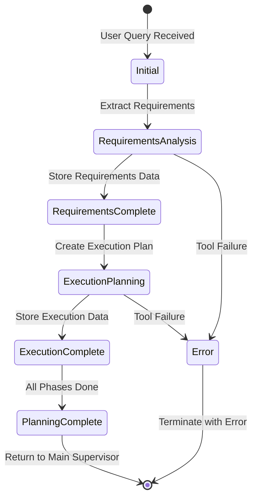
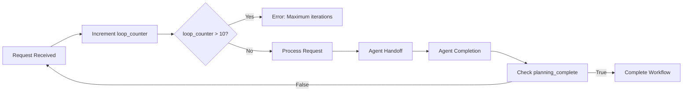
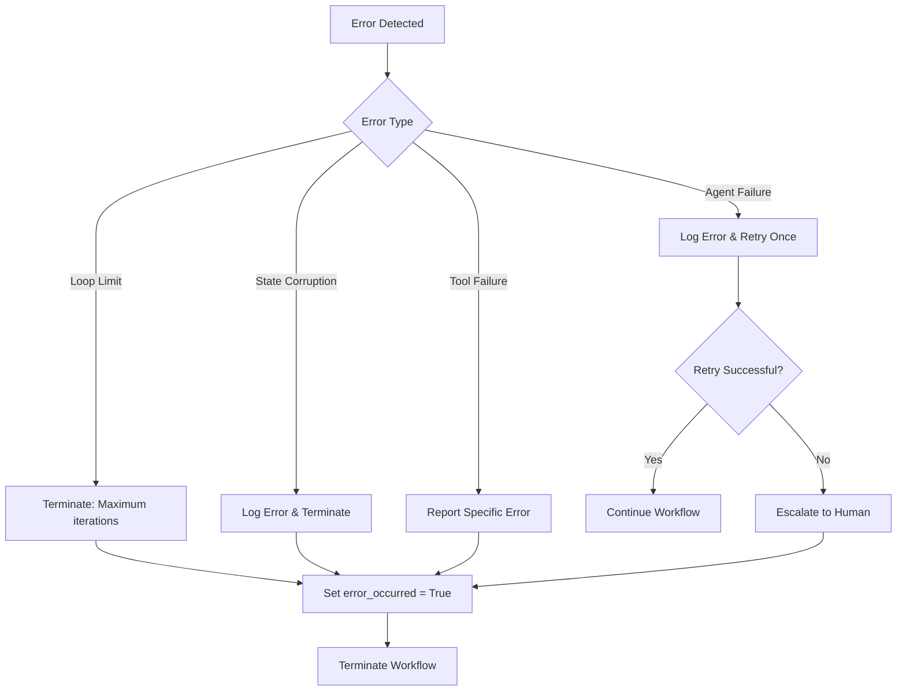

# Planner Sub-Supervisor Agent - Comprehensive Documentation

## Table of Contents
1. [Overview](#overview)
2. [Architecture](#architecture)
3. [Core Components](#core-components)
4. [Sub-Agents](#sub-agents)
5. [State Management](#state-management)
6. [Handoff Mechanisms](#handoff-mechanisms)
7. [Workflow Process](#workflow-process)
8. [Complete Flow Diagram](#complete-flow-diagram)
9. [Configuration](#configuration)
10. [Error Handling](#error-handling)
11. [Integration Points](#integration-points)
12. [API Reference](#api-reference)

## Overview

The **Planner Sub-Supervisor Agent** is a sophisticated orchestration component within the AWS Orchestrator Agent system that manages the planning workflow for infrastructure deployment. It acts as a sub-supervisor that coordinates between specialized planning agents to analyze user requirements and create comprehensive execution plans.

### Key Responsibilities
- **Workflow Coordination**: Manages the sequential execution of planning phases
- **Agent Routing**: Routes requests to appropriate specialized agents
- **State Management**: Maintains consistent state across agent transitions
- **Completion Detection**: Automatically detects when planning phases are complete
- **Error Prevention**: Implements safeguards against infinite loops and errors

### Core Functionality
- Analyzes user infrastructure requests
- Coordinates between requirements analysis and execution planning
- Maintains planning context and results
- Handles agent handoffs and state transitions
- Provides comprehensive planning results to the main supervisor

## Architecture

### High-Level Architecture

```
┌─────────────────────────────────────────────────────────────┐
│                    Main Supervisor                          │
│  ┌─────────────────────────────────────────────────────┐    │
│  │            Planner Sub-Supervisor                   │    │
│  │  ┌─────────────────┐  ┌─────────────────────────┐  │    │
│  │  │ Requirements    │  │    Execution Planner     │  │    │
│  │  │ Analyzer       │  │                         │  │    │
│  │  └─────────────────┘  └─────────────────────────┘  │    │
│  │                                                     │    │
│  │  ┌─────────────────────────────────────────────────┐  │    │
│  │  │           State Management System               │  │    │
│  │  └─────────────────────────────────────────────────┘  │    │
│  └─────────────────────────────────────────────────────┘    │
└─────────────────────────────────────────────────────────────┘
```

### Component Relationships

The planner sub-supervisor uses the **langgraph-supervisor** library to create a sophisticated agent coordination system with:

- **Central Supervisor**: Coordinates workflow and agent routing
- **Sub-Agents**: Specialized React agents for specific planning tasks
- **Handoff Tools**: Custom tools for agent transitions
- **State Schema**: Comprehensive state management
- **Memory System**: Shared memory for state persistence

## Core Components

### 1. PlannerSubSupervisorAgent

The main supervisor class that orchestrates the planning workflow.

**Key Features:**
- Inherits from `BaseSubgraphAgent`
- Uses `langgraph-supervisor` for agent coordination
- Implements custom handoff tools
- Manages shared state across agents
- Provides comprehensive logging and error handling

**Initialization Process:**
1. **Configuration Setup**: Loads LLM configuration and settings
2. **Sub-Agent Creation**: Initializes specialized planning agents
3. **Handoff Tools**: Creates custom handoff tools for agent transitions
4. **Supervisor Prompt**: Defines the coordination logic and routing rules
5. **Graph Building**: Constructs the LangGraph state graph

### 2. State Management System

#### PlannerSupervisorState
The central state model that tracks the entire planning workflow:

```python
class PlannerSupervisorState(BaseModel):
    # LangGraph required fields
    messages: Annotated[List[AnyMessage], add_messages]
    remaining_steps: int
    llm_input_messages: Annotated[List[AnyMessage], add_messages]
    
    # Planning workflow state
    planning_workflow_state: PlanningWorkflowState
    
    # Agent-specific data
    requirements_data: RequirementsData
    execution_data: ExecutionData
    
    # Planning results
    planning_results: PlanningResults
    
    # Context and metadata
    user_request: str
    task_description: str
    session_id: str
    task_id: str
    active_agent: str
    status: str
```

#### PlanningWorkflowState
Tracks the progression through planning phases:

```python
class PlanningWorkflowState(BaseModel):
    current_phase: str = "requirements_analysis"
    requirements_complete: bool = False
    execution_complete: bool = False
    planning_complete: bool = False
    loop_counter: int = 0
    error_occurred: bool = False
    error_message: Optional[str] = None
```

### 3. Handoff Tools System

Custom tools that enable seamless agent transitions:

- **`handoff_to_requirements_analyzer`**: Transfers to requirements analysis
- **`handoff_to_execution_planner`**: Transfers to execution planning
- **`mark_planning_complete`**: Marks planning as complete
- **`handoff_to_planner_complete`**: Returns to main supervisor

## Sub-Agents

### 1. Requirements Analyzer Agent

**Purpose**: Analyzes user requirements and extracts infrastructure needs

**Key Tools:**
- **`infra_requirements_parser_tool`**: Extracts infrastructure requirements from natural language
- **`aws_service_discovery_tool`**: Discovers and maps AWS services
- **`get_final_resource_attributes_tool`**: Gets complete Terraform resource attributes

**Workflow:**
1. **Parse Requirements**: Extract structured requirements from user input
2. **Service Discovery**: Map requirements to AWS services
3. **Attribute Mapping**: Get detailed Terraform resource attributes
4. **State Update**: Store results in shared state

**Output Schema:**
```python
class InfrastructureRequirements(BaseModel):
    scope_classification: str  # single_service, multi_service, full_application_stack
    deployment_context: str
    services: List[ServiceRequirement]

class ServiceRequirement(BaseModel):
    service_name: str
    aws_service_type: str
    business_requirements: Dict[str, str]
    technical_specifications: Dict[str, str]
```

### 2. Execution Planner Agent

**Purpose**: Creates execution plans and assesses risks

**Key Tools:**
- **`create_module_structure_plan_tool`**: Creates Terraform module structure plans
- **`create_configuration_optimizations_tool`**: Generates configuration optimization strategies
- **`create_state_management_plans_tool`**: Plans state management strategies
- **`create_execution_plan_tool`**: Creates final execution plans

**Sequential Workflow:**
1. **Module Structure**: Plan Terraform module structure
2. **Configuration Optimization**: Optimize configurations
3. **State Management**: Plan state management
4. **Execution Plan**: Create final execution plan

**Output Schema:**
```python
class ExecutionPlanResponse(BaseModel):
    execution_plans: List[ExecutionPlan]
    complexity_assessment: ComplexityAssessment
    risk_analysis: RiskAnalysis
    deployment_strategy: DeploymentStrategy
```

### 3. Security & Best Practices Agent (Currently Disabled)

**Purpose**: Analyzes security compliance and AWS best practices

**Key Tools:**
- **`security_compliance_tool`**: Analyzes security compliance frameworks
- **`best_practices_tool`**: Analyzes AWS and Terraform best practices

**Status**: Currently commented out in the implementation

## State Management

### State Flow

```
Initial State → Requirements Analysis → Execution Planning → Completion
     ↓              ↓                        ↓              ↓
User Request → Requirements Data → Execution Data → Planning Results
```

### State Transitions

1. **Initialization**: Creates initial state with user request
2. **Requirements Phase**: Updates `requirements_data` and marks `requirements_complete`
3. **Execution Phase**: Updates `execution_data` and marks `execution_complete`
4. **Completion**: Marks `planning_complete` and prepares results

### State Persistence

- **Memory System**: Uses `MemorySaver` for state persistence
- **Shared State**: All agents access the same state instance
- **State Updates**: Atomic updates prevent race conditions
- **Completion Detection**: Automatic detection of phase completions

## Handoff Mechanisms

### Handoff Tool Structure

```python
def create_custom_handoff_tool(*, agent_name: str, name: str, description: str):
    @tool(name, description=description)
    def handoff_to_agent(
        task_description: str,
        state: Annotated[Any, InjectedState],
        tool_call_id: Annotated[str, InjectedToolCallId],
    ):
        return Command(
            goto=agent_name,
            graph=Command.PARENT,
            update={
                "messages": messages + [tool_message],
                "active_agent": agent_name,
                "task_description": task_description,
                "user_request": getattr(state, "user_request", task_description),
                # ... other state updates
            },
        )
```

### Handoff Process

1. **Tool Call**: Supervisor calls handoff tool with task description
2. **State Update**: Tool updates state with new context
3. **Agent Transfer**: Control transfers to target agent
4. **Context Preservation**: All relevant context is maintained
5. **Completion Detection**: Automatic detection when agent completes

## Workflow Process

### Planning Workflow Sequence

```
1. User Request → Planner Sub-Supervisor
2. Requirements Analysis → Requirements Analyzer
3. Execution Planning → Execution Planner
4. Completion → Return to Main Supervisor
```

### Detailed Workflow

#### Phase 1: Requirements Analysis
1. **Input**: User request and task description
2. **Processing**: Requirements analyzer extracts infrastructure needs
3. **Output**: AWS service mappings and Terraform attributes
4. **State Update**: `requirements_complete = True`

#### Phase 2: Execution Planning
1. **Input**: Requirements data from previous phase
2. **Processing**: Execution planner creates comprehensive plans
3. **Output**: Module structure, optimizations, and execution plans
4. **State Update**: `execution_complete = True`

#### Phase 3: Completion
1. **Detection**: Automatic detection of completion
2. **Results**: Aggregated planning results
3. **Handoff**: Return to main supervisor with results

### Loop Prevention

- **Loop Counter**: Tracks iterations to prevent infinite loops
- **Maximum Iterations**: 10 iterations maximum
- **Error Detection**: Automatic error detection and handling
- **State Validation**: Continuous state validation

## Complete Flow Diagram

### End-to-End Query Processing Flow

The following Mermaid diagram shows the complete flow of how a user query like **"can you help me in writing aws s3 module in terraform"** gets processed through the planner sub-supervisor agent:

```mermaid
graph TD
    %% User Input
    A["User Query: S3 Module Request"] --> B["Main Supervisor"]
    
    %% Main Supervisor Processing
    B --> C["Main Supervisor Handoff Tool"]
    C --> D["transfer_to_planner_sub_supervisor"]
    D --> E["Planner Sub-Supervisor Agent"]
    
    %% Planner Sub-Supervisor Initialization
    E --> F["Input Transform"]
    F --> G["Extract user_request, task_description, session_id, task_id"]
    G --> H["Create Initial Planner State"]
    H --> I["Set current_phase = requirements_analysis"]
    
    %% Pre-Model Hook Processing
    I --> J["Pre-Model Hook"]
    J --> K["Check if subsequent request"]
    K --> L["Process Subsequent Request"]
    L --> M["Check for agent completions"]
    M --> N["Increment loop_counter"]
    N --> O["Check loop_counter <= 10"]
    
    %% Loop Prevention Check
    O -->|"loop_counter > 10"| P["Error: Maximum iterations reached"]
    O -->|"loop_counter <= 10"| Q["Check planning_workflow_state.next_phase"]
    
    %% Phase Routing Logic
    Q --> R{"Check next_phase"}
    R -->|"requirements_analysis"| S["Check requirements_complete"]
    R -->|"execution_planning"| T["Check execution_complete"]
    R -->|"None"| U["All phases complete"]
    
    %% Requirements Analysis Phase
    S -->|"requirements_complete = False"| V["handoff_to_requirements_analyzer"]
    V --> W["Requirements Analyzer Agent"]
    
    %% Requirements Analyzer Tools Execution
    W --> X["infra_requirements_parser_tool"]
    X --> Y["Extract Infrastructure Requirements"]
    Y --> Z["aws_service_discovery_tool"]
    Z --> AA["Map AWS Services"]
    AA --> BB["get_final_resource_attributes_tool"]
    BB --> CC["Get Terraform Resource Attributes"]
    
    %% Requirements Completion
    CC --> DD["Store in requirements_data"]
    DD --> EE["Set requirements_complete = True"]
    EE --> FF["Mark phase complete: requirements_analysis"]
    FF --> GG["Update state.planning_workflow_state"]
    GG --> HH["Return to Planner Sub-Supervisor"]
    
    %% Execution Planning Phase
    HH --> II["Check next_phase = execution_planning"]
    II --> JJ["handoff_to_execution_planner"]
    JJ --> KK["Execution Planner Agent"]
    
    %% Execution Planner Sequential Tools
    KK --> LL["create_module_structure_plan_tool"]
    LL --> MM["Create Terraform Module Structure"]
    MM --> NN["create_configuration_optimizations_tool"]
    NN --> OO["Generate Configuration Optimizations"]
    OO --> PP["create_state_management_plans_tool"]
    PP --> QQ["Plan State Management Strategy"]
    QQ --> RR["create_execution_plan_tool"]
    RR --> SS["Create Final Execution Plan"]
    
    %% Execution Completion
    SS --> TT["Store in execution_data"]
    TT --> UU["Set execution_complete = True"]
    UU --> VV["Mark phase complete: execution_planning"]
    VV --> WW["Update state.planning_workflow_state"]
    WW --> XX["Return to Planner Sub-Supervisor"]
    
    %% Completion Detection
    XX --> YY["Check planning_workflow_state.planning_complete"]
    YY --> ZZ{"All phases complete?"}
    ZZ -->|"Yes"| AAA["mark_planning_complete"]
    ZZ -->|"No"| Q
    
    %% Final Handoff
    AAA --> BBB["Set planning_complete = True"]
    BBB --> CCC["handoff_to_planner_complete"]
    CCC --> DDD["Return to Main Supervisor"]
    DDD --> EEE["Output Transform"]
    EEE --> FFF["Return Planning Results"]
    
    %% Error Handling Paths
    P --> GGG["Error Handling"]
    GGG --> HHH["Log Error"]
    HHH --> III["Set error_occurred = True"]
    III --> JJJ["Terminate Workflow"]
    
    %% State Updates Throughout
    subgraph StateManagement ["State Management"]
        KKK["PlannerSupervisorState"]
        LLL["PlanningWorkflowState"]
        MMM["RequirementsData"]
        NNN["ExecutionData"]
        OOO["PlanningResults"]
    end
    
    %% Tool Execution Details
    subgraph RequirementsTools ["Requirements Analyzer Tools"]
        X
        Y
        Z
        AA
        BB
        CC
    end
    
    subgraph ExecutionTools ["Execution Planner Tools"]
        LL
        MM
        NN
        OO
        PP
        QQ
        RR
        SS
    end
    
    %% Styling
    classDef userInput fill:#e1f5fe
    classDef supervisor fill:#f3e5f5
    classDef agent fill:#e8f5e8
    classDef tool fill:#fff3e0
    classDef state fill:#fce4ec
    classDef error fill:#ffebee
    
    class A userInput
    class B,C,D,E supervisor
    class W,KK agent
    class X,Y,Z,AA,BB,CC,LL,MM,NN,OO,PP,QQ,RR,SS tool
    class KKK,LLL,MMM,NNN,OOO state
    class P,GGG,HHH,III,JJJ error
```



### Detailed Step-by-Step Processing

#### **Phase 1: Initial Request Processing**
1. **User Input**: "can you help me in writing aws s3 module in terraform"
2. **Main Supervisor**: Receives request and routes to planner sub-supervisor
3. **Input Transform**: Extracts user_request, task_description, session_id, task_id
4. **State Initialization**: Creates initial PlannerSupervisorState
5. **Phase Setting**: Sets current_phase = "requirements_analysis"

#### **Phase 2: Requirements Analysis**
1. **Routing Decision**: next_phase = "requirements_analysis", requirements_complete = False
2. **Handoff**: Calls `handoff_to_requirements_analyzer`
3. **Requirements Analyzer Execution**:
   - **Tool 1**: `infra_requirements_parser_tool` → Extracts S3 infrastructure requirements
   - **Tool 2**: `aws_service_discovery_tool` → Maps to AWS S3 service
   - **Tool 3**: `get_final_resource_attributes_tool` → Gets Terraform S3 resource attributes
4. **State Update**: Stores results in `requirements_data`, sets `requirements_complete = True`

#### **Phase 3: Execution Planning**
1. **Routing Decision**: next_phase = "execution_planning", execution_complete = False
2. **Handoff**: Calls `handoff_to_execution_planner`
3. **Execution Planner Sequential Execution**:
   - **Tool 1**: `create_module_structure_plan_tool` → Plans S3 module structure
   - **Tool 2**: `create_configuration_optimizations_tool` → Optimizes S3 configurations
   - **Tool 3**: `create_state_management_plans_tool` → Plans state management for S3
   - **Tool 4**: `create_execution_plan_tool` → Creates final S3 module execution plan
4. **State Update**: Stores results in `execution_data`, sets `execution_complete = True`

#### **Phase 4: Completion**
1. **Completion Check**: Both requirements_complete and execution_complete = True
2. **Final Actions**: 
   - Calls `mark_planning_complete` → Sets planning_complete = True
   - Calls `handoff_to_planner_complete` → Returns to main supervisor
3. **Output Transform**: Converts agent state to supervisor format
4. **Result Delivery**: Returns comprehensive S3 module planning results

### Key State Transitions



### Loop Prevention Mechanism



### Error Handling Flow



This comprehensive flow diagram shows exactly how a user query gets processed through every step of the planner sub-supervisor agent, including state management, error handling, and the complete workflow from initial request to final results.

## Configuration

### LLM Configuration

```python
llm_config = {
    "provider": "anthropic",  # or "openai", "azure", etc.
    "model": "claude-3-5-sonnet-20241022",
    "temperature": 0.1,
    "max_tokens": 4000
}
```

### Agent Configuration

```python
config = Config({
    "llm": {
        "provider": "anthropic",
        "model": "claude-3-5-sonnet-20241022",
        "temperature": 0.1,
        "max_tokens": 4000
    },
    "planning": {
        "max_iterations": 10,
        "timeout": 300
    }
})
```

### Memory Configuration

```python
memory = MemorySaver()  # Shared memory for state persistence
```

## Error Handling

### Error Types

1. **Loop Limit Exceeded**: Maximum iterations reached
2. **Agent Failures**: Sub-agent execution failures
3. **State Corruption**: Invalid state transitions
4. **Tool Failures**: Handoff tool failures

### Error Recovery

- **Automatic Retry**: Single retry for transient failures
- **State Validation**: Continuous state validation
- **Error Escalation**: Escalation to human when needed
- **Graceful Degradation**: Fallback mechanisms

### Logging

Comprehensive structured logging throughout the system:

```python
planner_supervisor_logger.log_structured(
    level="INFO",
    message="Planning workflow complete",
    extra={
        "completion_timestamp": datetime.now().isoformat(),
        "execution_plan_complete": True,
        "requirements_complete": True
    }
)
```

## Integration Points

### Main Supervisor Integration

- **Input Transform**: Transforms supervisor payload to agent state
- **Output Transform**: Transforms agent state back to supervisor format
- **State Sharing**: Shares state with main supervisor
- **Result Aggregation**: Aggregates planning results

### Sub-Agent Integration

- **Shared State**: All agents access the same state instance
- **Tool Integration**: Custom tools for agent communication
- **Completion Detection**: Automatic detection of agent completions
- **Error Propagation**: Error handling across agents

### External System Integration

- **MCP Client**: Integration with Model Context Protocol
- **LLM Provider**: Centralized LLM configuration
- **Memory System**: Shared memory for state persistence
- **Logging System**: Structured logging throughout

## API Reference

### PlannerSubSupervisorAgent

#### Constructor
```python
def __init__(
    self,
    config: Optional[Config] = None,
    custom_config: Optional[Dict[str, Any]] = None,
    name: str = "planner_sub_supervisor_agent",
    memory: Optional[MemorySaver] = None
)
```

#### Key Methods

**`build_graph()`**
- Builds the LangGraph state graph
- Returns: `StateGraph` instance

**`input_transform(send_payload: Dict[str, Any])`**
- Transforms supervisor payload to agent state
- Returns: `Dict[str, Any]` transformed state

**`output_transform(agent_state: Dict[str, Any])`**
- Transforms agent state back to supervisor format
- Returns: `Dict[str, Any]` output data

**`can_interrupt()`**
- Whether agent can interrupt for human input
- Returns: `bool` (always False for planning)

### Factory Functions

**`create_planner_sub_supervisor_agent()`**
```python
def create_planner_sub_supervisor_agent(
    config: Optional[Config] = None,
    custom_config: Optional[Dict[str, Any]] = None,
    name: str = "planner_sub_supervisor"
) -> PlannerSubSupervisorAgent
```

### State Models

#### PlannerSupervisorState
Main state model for the planner sub-supervisor

#### PlanningWorkflowState
Tracks workflow progression and completion

#### RequirementsData
Stores requirements analysis results

#### ExecutionData
Stores execution planning results

#### PlanningResults
Aggregated final planning results

### Handoff Tools

#### `create_handoff_to_requirements_analyzer()`
Creates handoff tool for requirements analyzer

#### `create_handoff_to_execution_planner()`
Creates handoff tool for execution planner

#### `create_mark_planning_complete()`
Creates tool to mark planning as complete

#### `create_handoff_to_planner_complete()`
Creates handoff tool to return to main supervisor

## Usage Examples

### Basic Usage

```python
from aws_orchestrator_agent.core.agents.planner.planner_sub_supervisor import create_planner_sub_supervisor_agent

# Create planner sub-supervisor
planner_agent = create_planner_sub_supervisor_agent(
    config=config,
    name="my_planner"
)

# Build the graph
graph = planner_agent.build_graph()

# Execute planning workflow
result = graph.invoke({
    "user_request": "Create an S3 bucket module",
    "task_description": "Generate Terraform module for S3 bucket",
    "session_id": "session_123",
    "task_id": "task_456"
})
```

### Advanced Configuration

```python
# Custom configuration
custom_config = {
    "llm": {
        "provider": "anthropic",
        "model": "claude-3-5-sonnet-20241022",
        "temperature": 0.1,
        "max_tokens": 4000
    },
    "planning": {
        "max_iterations": 15,
        "timeout": 600
    }
}

# Create with custom configuration
planner_agent = create_planner_sub_supervisor_agent(
    custom_config=custom_config,
    name="custom_planner"
)
```

## Best Practices

### Development
1. **State Management**: Always use the shared state instance
2. **Error Handling**: Implement comprehensive error handling
3. **Logging**: Use structured logging for debugging
4. **Testing**: Test each phase independently
5. **Configuration**: Use centralized configuration management

### Deployment
1. **Memory**: Use shared memory for state persistence
2. **Monitoring**: Monitor loop counters and completion status
3. **Error Recovery**: Implement proper error recovery mechanisms
4. **Performance**: Optimize for the expected workload
5. **Security**: Follow security best practices for LLM usage

### Maintenance
1. **Logging**: Regular log analysis for issues
2. **State Validation**: Continuous state validation
3. **Error Monitoring**: Monitor error rates and types
4. **Performance**: Monitor execution times and resource usage
5. **Updates**: Regular updates to LLM models and configurations

## Troubleshooting

### Common Issues

1. **Infinite Loops**: Check loop counter and completion detection
2. **State Corruption**: Validate state transitions
3. **Agent Failures**: Check agent initialization and configuration
4. **Memory Issues**: Verify memory configuration
5. **Tool Failures**: Check handoff tool implementation

### Debugging

1. **Enable Debug Logging**: Set log level to DEBUG
2. **State Inspection**: Log state at each transition
3. **Tool Validation**: Validate handoff tools
4. **Agent Testing**: Test agents independently
5. **Configuration Check**: Verify all configurations

### Performance Optimization

1. **LLM Configuration**: Optimize model and parameters
2. **Memory Usage**: Monitor memory consumption
3. **Execution Time**: Optimize for faster execution
4. **Resource Usage**: Monitor CPU and memory usage
5. **Caching**: Implement appropriate caching strategies

---

This documentation provides a comprehensive overview of the Planner Sub-Supervisor Agent, its architecture, components, and usage. For additional details, refer to the source code and related documentation.
