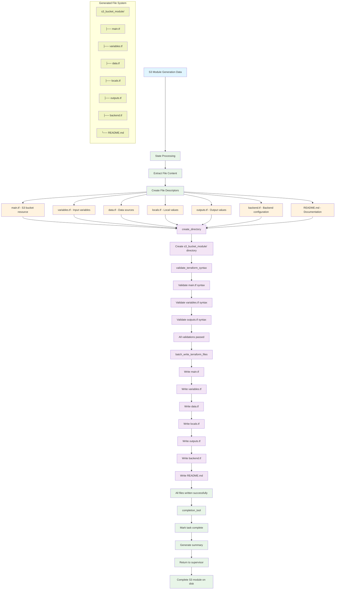

# Writer React Agent - Comprehensive Documentation

## Table of Contents
1. [Overview](#overview)
2. [Architecture](#architecture)
3. [Core Components](#core-components)
4. [State Management](#state-management)
5. [Tools and Operations](#tools-and-operations)
6. [Workflow Process](#workflow-process)
7. [Complete Flow Diagram](#complete-flow-diagram)
8. [File Writing Process](#file-writing-process)
9. [Error Handling](#error-handling)
10. [Integration Points](#integration-points)
11. [API Reference](#api-reference)

## Overview

The **Writer React Agent** is the final executor in the multi-agent Terraform provisioning pipeline. It takes the generated Terraform content from the Generator Swarm Agent and writes it to the filesystem as structured Terraform modules.

### Key Responsibilities
- **File Writing**: Writes Terraform files to disk using LangChain's WriteFileTool
- **Content Validation**: Validates Terraform syntax before writing
- **Directory Management**: Creates necessary directory structures
- **Error Handling**: Comprehensive error handling and recovery
- **State Tracking**: Tracks all file operations and their status
- **Completion Reporting**: Reports completion status back to supervisor

### Core Functionality
- Processes generation data from the generator swarm
- Validates Terraform syntax before writing
- Creates directory structures as needed
- Writes files using batch operations for efficiency
- Tracks all operations with detailed logging
- Handles errors gracefully and continues with remaining operations

## Architecture

### High-Level Architecture

```
┌─────────────────────────────────────────────────────────────┐
│                    Main Supervisor                          │
│  ┌─────────────────────────────────────────────────────┐    │
│  │            Generator Swarm Agent                   │    │
│  │  ┌─────────────┐ ┌─────────────┐ ┌─────────────┐  │    │
│  │  │ Resource    │ │ Variable    │ │ Data Source │  │    │
│  │  │ Agent       │ │ Agent       │ │ Agent       │  │    │
│  │  └─────────────┘ └─────────────┘ └─────────────┘  │    │
│  │  ┌─────────────┐ ┌─────────────┐ ┌─────────────┐  │    │
│  │  │ Local       │ │ Output      │ │ Backend     │  │    │
│  │  │ Values      │ │ Agent       │ │ Agent       │  │    │
│  │  │ Agent       │ │             │ │             │  │    │
│  │  └─────────────┘ └─────────────┘ └─────────────┘  │    │
│  │  ┌─────────────────────────────────────────────┐  │    │
│  │  │           README Agent                      │  │    │
│  │  └─────────────────────────────────────────────┘  │    │
│  └─────────────────────────────────────────────────────┘    │
│                           ↓                                 │
│  ┌─────────────────────────────────────────────────────┐    │
│  │            Writer React Agent                      │    │
│  │  ┌─────────────┐ ┌─────────────┐ ┌─────────────┐  │    │
│  │  │ File        │ │ Directory   │ │ Validation  │  │    │
│  │  │ Writing     │ │ Management  │ │ Tools       │  │    │
│  │  │ Tools       │ │ Tools       │ │             │  │    │
│  │  └─────────────┘ └─────────────┘ └─────────────┘  │    │
│  │  ┌─────────────────────────────────────────────┐  │    │
│  │  │           State Management                  │  │    │
│  │  └─────────────────────────────────────────────┘  │    │
│  └─────────────────────────────────────────────────────┘    │
│                           ↓                                 │
│  ┌─────────────────────────────────────────────────────┐    │
│  │            File System                             │    │
│  │  ┌─────────────┐ ┌─────────────┐ ┌─────────────┐  │    │
│  │  │ main.tf     │ │ variables.tf│ │ outputs.tf  │  │    │
│  │  │ data.tf     │ │ locals.tf   │ │ backend.tf  │  │    │
│  │  │ README.md   │ │             │ │             │  │    │
│  │  └─────────────┘ └─────────────┘ └─────────────┘  │    │
│  └─────────────────────────────────────────────────────┘    │
└─────────────────────────────────────────────────────────────┘
```

### Component Relationships

The Writer React Agent uses a **React Agent Pattern** with sophisticated state management:

- **React Agent**: Uses LangChain's `create_react_agent` for tool-based execution
- **State Injection**: Tools receive injected state for context awareness
- **File Operations**: Comprehensive file writing and management tools
- **Error Tracking**: Detailed error and operation tracking
- **Completion Detection**: Automatic completion detection and reporting

## Core Components

### 1. WriterReactAgent

The main agent that orchestrates the file writing workflow.

**Key Features:**
- Inherits from `BaseSubgraphAgent`
- Uses React agent pattern with tool-based execution
- Implements sophisticated state management
- Provides comprehensive error handling and logging
- Tracks all file operations with detailed records

**Initialization Process:**
1. **Configuration Setup**: Loads LLM configuration and settings
2. **Tool Creation**: Creates specialized file operation tools
3. **Agent Building**: Constructs the React agent with tools
4. **State Management**: Sets up state tracking and error handling

### 2. State Management System

#### WriterReactState
The comprehensive state model that tracks the entire writing workflow:

```python
class WriterReactState(BaseModel):
    # Input context
    messages: Annotated[List[AnyMessage], add_messages]
    workspace_path: Optional[str]
    module_name: Optional[str]
    generation_data: Optional[Dict[str, Any]]
    module_structure_plan: Optional[List[Dict[str, Any]]]
    
    # Files management
    files_to_write: List[FileDescriptor]
    
    # Operations tracking
    operations: List[FileOperationRecord]
    
    # Agent state
    status: WriteStatus
    current_operation: Optional[OperationType]
    
    # Message management
    internal_messages: List[Any]
    llm_input_messages: List[Any]
    
    # Error handling
    errors: List[ErrorRecord]
    warnings: List[str]
    
    # Coordination
    task_id: Optional[str]
    session_id: Optional[str]
    retry_count: int
    
    # Completion data
    completion_status: Optional[str]
    completion_summary: Optional[str]
    completion_files_created: Optional[List[str]]
    
    # Progress tracking
    progress: Dict[str, Any]
```

#### WriteStatus
Tracks the overall writing status:

```python
class WriteStatus(str, Enum):
    PENDING = "pending"
    IN_PROGRESS = "in_progress"
    COMPLETED = "completed"
    FAILED = "failed"
```

#### OperationType
Tracks different types of file operations:

```python
class OperationType(str, Enum):
    CREATE_DIR = "create_directory"
    VALIDATE = "validate_content"
    WRITE_FILE = "write_file"
    EDIT_FILE = "edit_file"
    BATCH_WRITE = "batch_write"
```

### 3. File Management System

#### FileDescriptor
Describes a file to be written:

```python
class FileDescriptor(BaseModel):
    path: str = Field(..., description="Relative path including filename")
    content: str = Field(..., description="HCL or other content")
    subdirectory: Optional[str] = Field(None, description="Optional subdirectory")
    file_type: Optional[str] = Field(None, description="File type (main, variables, outputs, etc.)")
```

#### FileOperationRecord
Tracks individual file operations:

```python
class FileOperationRecord(BaseModel):
    file: FileDescriptor = Field(..., description="The file being operated on")
    operation: OperationType = Field(..., description="Type of operation")
    status: WriteStatus = Field(WriteStatus.PENDING, description="Operation status")
    started_at: Optional[datetime] = Field(None, description="Timestamp when operation began")
    completed_at: Optional[datetime] = Field(None, description="Timestamp when operation finished")
    error: Optional[str] = Field(None, description="Error message if failed")
    result: Optional[str] = Field(None, description="Operation result message")
```

#### ErrorRecord
Structured error information:

```python
class ErrorRecord(BaseModel):
    code: Optional[str] = Field(None, description="Optional error code")
    message: str = Field(..., description="Error message")
    timestamp: datetime = Field(default_factory=datetime.utcnow)
    operation_type: Optional[OperationType] = Field(None, description="Operation that caused the error")
```

## State Management

### State Flow

```
Generation Data → State Processing → File Preparation → Validation → Writing → Completion
```

### State Transitions

1. **Initialization**: Receives generation data from generator swarm
2. **Processing**: Processes generation data and creates file descriptors
3. **Preparation**: Prepares files for writing with validation
4. **Writing**: Writes files to disk with error handling
5. **Completion**: Reports completion status to supervisor

### State Processing

The agent processes generation data in multiple formats:

#### Legacy Format (generated_module)
```python
{
    "generated_module": {
        "resources": "main.tf content",
        "variables": "variables.tf content",
        "outputs": "outputs.tf content",
        "data_sources": "data.tf content",
        "locals": "locals.tf content",
        "backend": "backend.tf content",
        "readme": "README.md content"
    }
}
```

#### Modern Format (terraform_files)
```python
{
    "terraform_files": [
        {
            "file_name": "main.tf",
            "content": "HCL content",
            "subdirectory": "optional/path",
            "file_type": "main"
        }
    ]
}
```

#### Content Format (_content suffix)
```python
{
    "main_content": "HCL content",
    "variables_content": "HCL content",
    "outputs_content": "HCL content"
}
```

## Tools and Operations

### 1. File Writing Tools

#### `write_terraform_file`
Writes a single Terraform file to disk:

```python
@tool
def write_terraform_file(
    file_data: dict,
    state: Annotated[WriterReactState, InjectedState]
) -> str:
    """
    Write a Terraform file to disk with state tracking.
    
    Args:
        file_data: Dict with 'file_path' and 'text' keys
        state: Injected WriterReactState
    """
```

**Features:**
- Uses LangChain's WriteFileTool
- Tracks operation status
- Handles errors gracefully
- Updates state with operation records

#### `batch_write_terraform_files`
Writes multiple Terraform files in batch:

```python
@tool
def batch_write_terraform_files(
    files_data: dict,
    state: Annotated[WriterReactState, InjectedState]
) -> str:
    """
    Write multiple Terraform files in batch with state tracking.
    
    Args:
        files_data: Dict with 'files' key containing list of file data
        state: Injected WriterReactState
    """
```

**Features:**
- Efficient batch processing
- Individual file error handling
- Progress tracking
- Detailed result reporting

### 2. File Management Tools

#### `edit_terraform_file`
Edits existing Terraform files:

```python
@tool
def edit_terraform_file(
    edit_data: dict,
    state: Annotated[WriterReactState, InjectedState]
) -> str:
    """
    Edit an existing Terraform file with state tracking.
    
    Args:
        edit_data: Dict with 'file_path', 'new_content', and optional 'backup' keys
        state: Injected WriterReactState
    """
```

**Features:**
- Backup creation before editing
- State tracking
- Error handling
- Operation logging

#### `create_directory`
Creates directory structures:

```python
@tool
def create_directory(
    directory_data: dict,
    state: Annotated[WriterReactState, InjectedState]
) -> str:
    """
    Create a directory with state tracking.
    
    Args:
        directory_data: Dict with 'path' key
        state: Injected WriterReactState
    """
```

**Features:**
- Directory creation with error handling
- State tracking
- Operation logging
- Path validation

### 3. Validation Tools

#### `validate_terraform_syntax`
Validates Terraform syntax before writing:

```python
@tool
def validate_terraform_syntax(
    validation_data: dict,
    state: Annotated[WriterReactState, InjectedState]
) -> str:
    """
    Validate Terraform syntax with state tracking.
    
    Args:
        validation_data: Dict with 'content' key containing HCL to validate
        state: Injected WriterReactState
    """
```

**Features:**
- Basic syntax validation
- Keyword detection
- Brace matching
- Warning and error reporting

### 4. Utility Tools

#### `list_files`
Lists files in a directory:

```python
@tool
def list_files(
    list_data: dict,
    state: Annotated[WriterReactState, InjectedState]
) -> str:
    """
    List files in a directory with state tracking.
    
    Args:
        list_data: Dict with 'directory_path' and optional 'pattern' keys
        state: Injected WriterReactState
    """
```

#### `read_file`
Reads file contents:

```python
@tool
def read_file(
    read_data: dict,
    state: Annotated[WriterReactState, InjectedState]
) -> str:
    """
    Read the contents of a file with state tracking.
    
    Args:
        read_data: Dict with 'file_path' key
        state: Injected WriterReactState
    """
```

### 5. Completion Tool

#### `completion_tool`
Marks task completion and reports results:

```python
@tool
def completion_tool(
    completion_data: dict,
    state: Annotated[WriterReactState, InjectedState],
    tool_call_id: Annotated[str, InjectedToolCallId]
) -> dict:
    """
    Mark the writing process as complete, transform state, and handover to supervisor.
    
    Args:
        completion_data: Dict with 'result', optional 'summary', and optional 'files_created' keys
        state: Injected WriterReactState
        tool_call_id: Injected tool call ID for proper message handling
    """
```

**Features:**
- Completion status reporting
- File creation summary
- State transformation
- Supervisor handover

## Workflow Process

### Writing Workflow Sequence

```
1. Generation Data → State Processing
2. File Preparation → Directory Creation
3. Content Validation → File Writing
4. Error Handling → Completion Reporting
```

### Detailed Workflow

#### Phase 1: Data Processing
1. **Input**: Generation data from generator swarm
2. **Processing**: Extract file content and create file descriptors
3. **Preparation**: Prepare files for writing with metadata
4. **State Update**: Update state with files to write

#### Phase 2: File Operations
1. **Directory Creation**: Create necessary directory structures
2. **Content Validation**: Validate Terraform syntax
3. **File Writing**: Write files to disk (single or batch)
4. **Error Handling**: Handle errors and continue with remaining files

#### Phase 3: Completion
1. **Status Tracking**: Track completion status of all operations
2. **Error Reporting**: Report any errors encountered
3. **Completion**: Mark task complete and report results
4. **Handover**: Return results to supervisor

### Tool Execution Flow

```
System Message → Tool Selection → Tool Execution → State Update → Next Tool
```

## Complete Flow Diagram

### End-to-End Writing Flow

The following Mermaid diagram shows the complete flow of how generation data gets processed and written to files:

```mermaid
graph TD
    %% Generation Data Input
    A["Generation Data from Generator Swarm"] --> B["Main Supervisor"]
    B --> C["State Transformation"]
    C --> D["Writer React Agent"]
    
    %% State Processing
    D --> E["Preprocess Generation Data"]
    E --> F["Extract File Content"]
    F --> G["Create File Descriptors"]
    G --> H["Update WriterReactState"]
    
    %% File Preparation
    H --> I["Convert State to Messages"]
    I --> J["Create System Message"]
    J --> K["Initialize React Agent"]
    
    %% Tool Execution
    K --> L["React Agent Execution"]
    L --> M["Tool Selection"]
    M --> N{"Tool Type"}
    
    %% Directory Operations
    N -->|"Directory"| O["create_directory"]
    O --> P["Create Directory Structure"]
    P --> Q["Update Operation Record"]
    Q --> R["Continue to Next Tool"]
    
    %% Validation Operations
    N -->|"Validation"| S["validate_terraform_syntax"]
    S --> T["Validate HCL Syntax"]
    T --> U["Check Keywords & Braces"]
    U --> V["Report Validation Results"]
    V --> R
    
    %% File Writing Operations
    N -->|"Single File"| W["write_terraform_file"]
    N -->|"Batch Files"| X["batch_write_terraform_files"]
    
    %% Single File Writing
    W --> Y["Create Operation Record"]
    Y --> Z["Use WriteFileTool"]
    Z --> AA["Write File to Disk"]
    AA --> BB["Update Operation Status"]
    BB --> CC["Log Success/Error"]
    CC --> R
    
    %% Batch File Writing
    X --> DD["Process File List"]
    DD --> EE["For Each File"]
    EE --> FF["Create Operation Record"]
    FF --> GG["Use WriteFileTool"]
    GG --> HH["Write File to Disk"]
    HH --> II["Update Operation Status"]
    II --> JJ["Log Success/Error"]
    JJ --> KK{"More Files?"}
    KK -->|"Yes"| EE
    KK -->|"No"| LL["Batch Complete"]
    LL --> R
    
    %% Completion
    R --> MM{"All Operations Complete?"}
    MM -->|"No"| M
    MM -->|"Yes"| NN["completion_tool"]
    NN --> OO["Mark Task Complete"]
    OO --> PP["Generate Summary"]
    PP --> QQ["Transform State"]
    QQ --> RR["Return to Supervisor"]
    RR --> SS["Complete Terraform Module"]
    
    %% Error Handling
    CC -->|"Error"| TT["Error Handling"]
    JJ -->|"Error"| TT
    TT --> UU["Log Error Record"]
    UU --> VV["Update Operation Status"]
    VV --> WW["Continue with Remaining Files"]
    WW --> R
    
    %% State Management
    subgraph StateManagement ["State Management"]
        XX["WriterReactState"]
        YY["File Descriptors"]
        ZZ["Operation Records"]
        AAA["Error Records"]
        BBB["Completion Data"]
    end
    
    %% Tool Execution Details
    subgraph FileTools ["File Writing Tools"]
        W
        X
        Y
        Z
        AA
        BB
        CC
    end
    
    subgraph ManagementTools ["Management Tools"]
        O
        P
        Q
        S
        T
        U
        V
    end
    
    subgraph UtilityTools ["Utility Tools"]
        CCC["list_files"]
        DDD["read_file"]
        EEE["edit_terraform_file"]
    end
    
    %% Styling
    classDef generationData fill:#e1f5fe
    classDef supervisor fill:#f3e5f5
    classDef agent fill:#e8f5e8
    classDef tool fill:#fff3e0
    classDef state fill:#fce4ec
    classDef error fill:#ffebee
    classDef completion fill:#e8f5e8
    classDef filesystem fill:#f0f4c3
    classDef utility fill:#e3f2fd
    
    class A generationData
    class B,C,D supervisor
    class E,F,G,H,I,J,K,L agent
    class M,N,O,P,Q,R,S,T,U,V,W,X,Y,Z,AA,BB,CC,DD,EE,FF,GG,HH,II,JJ,KK,LL,MM,NN,OO,PP,QQ,RR,SS tool
    class XX,YY,ZZ,AAA,BBB state
    class TT,UU,VV,WW error
    class CCC,DDD,EEE utility
    class SS filesystem
```



### S3 Module Writing Example

The following diagram shows a specific example of how an S3 module gets written:



### Key Writing Steps for S3 Module

#### **Step 1: Data Processing**
- **Input**: S3 module generation data from generator swarm
- **Process**: Extract file content and create file descriptors
- **Output**: List of files to write with metadata

#### **Step 2: Directory Creation**
- **Input**: File descriptors with paths
- **Process**: Create necessary directory structures
- **Output**: Directory structure ready for files

#### **Step 3: Content Validation**
- **Input**: File content for each Terraform file
- **Process**: Validate HCL syntax and structure
- **Output**: Validation results and warnings

#### **Step 4: File Writing**
- **Input**: Validated file content and paths
- **Process**: Write files to disk using batch operations
- **Output**: All Terraform files written successfully

#### **Step 5: Completion**
- **Input**: Writing results and file paths
- **Process**: Generate completion summary
- **Output**: Complete S3 module on disk

### Final S3 Module Structure

```
s3_bucket_module/
├── main.tf          # S3 bucket resource
├── variables.tf     # Input variables
├── data.tf          # Data sources
├── locals.tf        # Local values
├── outputs.tf       # Output values
├── backend.tf       # Backend configuration
└── README.md        # Documentation
```

## File Writing Process

### File Processing Pipeline

```
Generation Data → File Extraction → Validation → Writing → Completion
```

### Detailed File Processing

#### 1. Data Extraction
- **Legacy Format**: Extract from `generated_module` structure
- **Modern Format**: Extract from `terraform_files` array
- **Content Format**: Extract from `*_content` fields
- **Metadata**: Extract file types, paths, and subdirectories

#### 2. File Descriptor Creation
```python
file_desc = FileDescriptor(
    path=file_info.get("file_name", "unknown.tf"),
    content=file_info.get("content", ""),
    subdirectory=file_info.get("subdirectory", ""),
    file_type=file_info.get("file_type", "unknown")
)
```

#### 3. Validation Process
- **Syntax Check**: Basic HCL syntax validation
- **Keyword Detection**: Identify Terraform keywords
- **Brace Matching**: Ensure proper brace matching
- **Content Validation**: Check for empty or invalid content

#### 4. Writing Process
- **Directory Creation**: Create necessary directories
- **File Writing**: Write files using WriteFileTool
- **Error Handling**: Handle individual file errors
- **Progress Tracking**: Track writing progress

#### 5. Completion Process
- **Status Aggregation**: Aggregate all operation statuses
- **Error Reporting**: Report any errors encountered
- **Summary Generation**: Generate completion summary
- **State Transformation**: Transform state for supervisor

## Error Handling

### Error Types

1. **File Writing Errors**: Individual file write failures
2. **Directory Creation Errors**: Directory creation failures
3. **Validation Errors**: Syntax validation failures
4. **State Errors**: State management errors
5. **Tool Errors**: Tool execution errors

### Error Recovery

- **Individual File Errors**: Continue with remaining files
- **Directory Errors**: Retry with different paths
- **Validation Errors**: Report warnings and continue
- **State Errors**: Log errors and continue
- **Tool Errors**: Retry with error handling

### Error Tracking

```python
error = ErrorRecord(
    code="WRITE_FILE_ERROR",
    message=str(e),
    operation_type=OperationType.WRITE_FILE
)
state.errors.append(error)
```

### Error Reporting

- **Structured Errors**: Use ErrorRecord for structured error information
- **Operation Tracking**: Track errors per operation
- **Warning System**: Non-fatal warnings for minor issues
- **Completion Status**: Include error status in completion

## Integration Points

### Supervisor Integration

- **Input Transform**: Receives generation data from supervisor
- **Output Transform**: Returns completion status to supervisor
- **State Isolation**: Maintains separate state schema
- **Result Aggregation**: Aggregates writing results

### Generator Swarm Integration

- **Data Reception**: Receives generated Terraform content
- **Format Handling**: Handles multiple data formats
- **Content Processing**: Processes generated content
- **File Creation**: Creates structured file system

### File System Integration

- **WriteFileTool**: Uses LangChain's WriteFileTool
- **Directory Management**: Creates directory structures
- **Path Handling**: Handles relative and absolute paths
- **File Operations**: Comprehensive file operations

## API Reference

### WriterReactAgent

#### Constructor
```python
def __init__(
    self,
    config: Optional[Config] = None,
    custom_config: Optional[Dict[str, Any]] = None,
    name: str = "writer_react_agent",
    memory: Optional[MemorySaver] = None
)
```

#### Key Methods

**`build_graph()`**
- Builds the LangGraph StateGraph
- Returns: `StateGraph` instance

**`_process_generation_data(state: WriterReactState)`**
- Processes generation data and creates file descriptors
- Returns: Updated `WriterReactState`

**`output_transform(agent_state: Dict[str, Any])`**
- Transforms agent state back to supervisor format
- Returns: `Dict[str, Any]` output data

### State Models

#### WriterReactState
Main state model for the writer agent

#### FileDescriptor
Describes a file to be written

#### FileOperationRecord
Tracks individual file operations

#### ErrorRecord
Structured error information

### Tools

#### File Writing Tools
- `write_terraform_file`: Write single file
- `batch_write_terraform_files`: Write multiple files
- `edit_terraform_file`: Edit existing file

#### Management Tools
- `create_directory`: Create directory structure
- `validate_terraform_syntax`: Validate HCL syntax

#### Utility Tools
- `list_files`: List files in directory
- `read_file`: Read file contents

#### Completion Tool
- `completion_tool`: Mark task complete

## Usage Examples

### Basic Usage

```python
from aws_orchestrator_agent.core.agents.writer.writer_react_agent import create_writer_react_agent

# Create writer agent
writer_agent = create_writer_react_agent(
    config=config,
    name="my_writer"
)

# Build the graph
graph = writer_agent.build_graph()

# Execute writing workflow
result = graph.invoke({
    "generation_data": generation_data,
    "workspace_path": "./terraform",
    "module_name": "s3_bucket_module",
    "task_id": "task_123",
    "session_id": "session_456"
})
```

### Advanced Configuration

```python
# Custom configuration
custom_config = {
    "llm": {
        "provider": "anthropic",
        "model": "claude-3-5-sonnet-20241022",
        "temperature": 0.1,
        "max_tokens": 4000
    },
    "writer": {
        "workspace_path": "./custom_terraform",
        "backup_files": True,
        "validate_syntax": True
    }
}

# Create with custom configuration
writer_agent = create_writer_react_agent(
    custom_config=custom_config,
    name="custom_writer"
)
```

## Best Practices

### Development
1. **State Management**: Always use the injected state
2. **Error Handling**: Implement comprehensive error handling
3. **Operation Tracking**: Track all file operations
4. **Validation**: Validate content before writing
5. **Logging**: Use structured logging for debugging

### Deployment
1. **Workspace Management**: Use proper workspace paths
2. **File Permissions**: Ensure proper file permissions
3. **Error Recovery**: Implement proper error recovery
4. **Monitoring**: Monitor file writing operations
5. **Security**: Follow security best practices

### Maintenance
1. **Logging**: Regular log analysis for issues
2. **Error Monitoring**: Monitor error rates and types
3. **Performance**: Monitor writing performance
4. **File System**: Monitor file system usage
5. **Updates**: Regular updates to tools and configurations

## Troubleshooting

### Common Issues

1. **File Writing Failures**: Check permissions and paths
2. **State Corruption**: Validate state transitions
3. **Tool Failures**: Check tool implementations
4. **Validation Errors**: Check HCL syntax
5. **Directory Issues**: Verify directory creation

### Debugging

1. **Enable Debug Logging**: Set log level to DEBUG
2. **State Inspection**: Log state at each transition
3. **Tool Validation**: Validate tool implementations
4. **File System Check**: Verify file system operations
5. **Configuration Check**: Verify all configurations

### Performance Optimization

1. **Batch Operations**: Use batch writing for efficiency
2. **Directory Management**: Optimize directory creation
3. **Validation**: Optimize validation processes
4. **Error Handling**: Optimize error handling
5. **State Management**: Optimize state operations

---

This documentation provides a comprehensive overview of the Writer React Agent, its architecture, components, and usage. For additional details, refer to the source code and related documentation.
