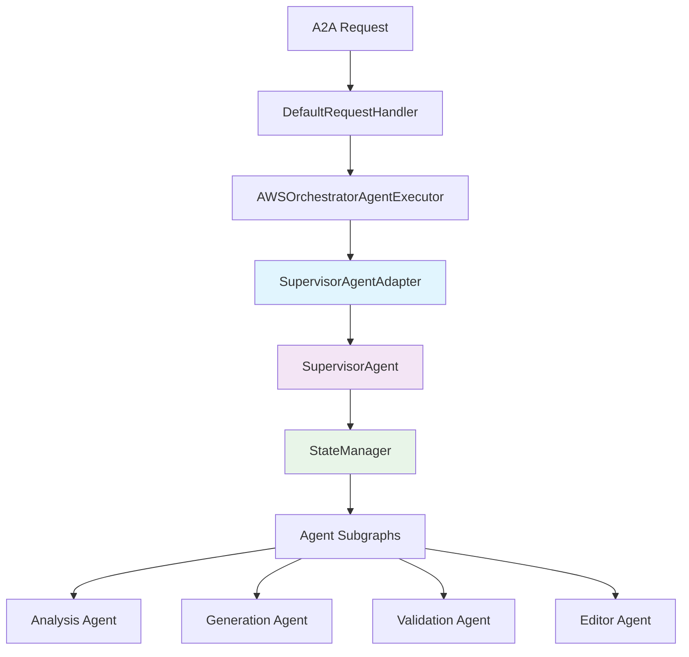

# Supervisor Agent A2A Integration

## Overview

This document explains how to integrate the Supervisor Agent with the A2A (Agent-to-Agent) protocol executor, enabling the Supervisor Agent to be used as a standard A2A agent while maintaining its LangGraph-based orchestration capabilities.

## Architecture Integration

### Integration Flow



### Key Components

1. **DefaultRequestHandler**: A2A protocol handler that accepts agent_executor
2. **AWSOrchestratorAgentExecutor**: Implements AgentExecutor interface
3. **SupervisorAgentAdapter**: Bridges SupervisorAgent with BaseAgent interface
4. **SupervisorAgent**: LangGraph-based orchestration with StateManager
5. **StateManager**: Handles state transformations and workflow management

## Integration Points

### 1. A2A Executor Integration Point

The key integration happens in the `_execute_agent_stream` method of `AWSOrchestratorAgentExecutor`:

```python
# In aws_orchestrator_agent/core/a2a_executor.py, line 170
await self._execute_agent_stream(query, task, updater)
```

This method calls:
```python
agent_stream = self.agent.stream(query, task.contextId, task.id)
```

### 2. SupervisorAgentAdapter Implementation

The `SupervisorAgentAdapter` implements the `BaseAgent` interface:

```python
class SupervisorAgentAdapter(BaseAgent):
    async def stream(
        self, 
        query: str, 
        context_id: str, 
        task_id: str
    ) -> AsyncGenerator[AgentResponse, None]:
        # Initialize workflow in Supervisor Agent
        self.supervisor_agent.initialize_workflow(query, {"a2a_context_id": context_id})
        
        # Execute supervisor workflow
        await self._execute_supervisor_workflow(query, task_id, context_id)
```

## Usage Examples

### 1. Basic Integration Setup

```python
from aws_orchestrator_agent.core import (
    SupervisorAgent,
    SupervisorAgentAdapter,
    AWSOrchestratorAgentExecutor,
    create_supervisor_agent_adapter
)
from a2a.server.request_handlers import DefaultRequestHandler

# Create Supervisor Agent
supervisor_agent = SupervisorAgent(
    model_name="openai:gpt-4.1",
    config=SUPERVISOR_CONFIG
)

# Create adapter
adapter = create_supervisor_agent_adapter(
    supervisor_agent=supervisor_agent,
    name="aws-orchestrator-supervisor",
    config={"max_snapshots": 15}
)

# Create A2A executor
executor = AWSOrchestratorAgentExecutor(
    agent=adapter,
    task_lifecycle_manager=task_lifecycle_manager
)

# Create A2A request handler
handler = DefaultRequestHandler(agent_executor=executor)
```

### 2. Advanced Configuration

```python
# Configure Supervisor Agent with specialized agents
supervisor_agent = SupervisorAgent(
    model_name="openai:gpt-4.1",
    config={
        **SUPERVISOR_CONFIG,
        "max_snapshots": 20,
        "default_agent_timeout": 180,
        "human_approval_required": [
            "terraform_apply",
            "security_violations",
            "cost_threshold_exceeded"
        ]
    }
)

# Register agent subgraphs (when implemented)
# supervisor_agent.register_agent_subgraph("analysis", analysis_subgraph)
# supervisor_agent.register_agent_subgraph("generation", generation_subgraph)
# supervisor_agent.register_agent_subgraph("validation", validation_subgraph)
# supervisor_agent.register_agent_subgraph("editor", editor_subgraph)

# Create supervisor
supervisor_agent.create_supervisor()

# Create adapter with custom configuration
adapter = SupervisorAgentAdapter(
    supervisor_agent=supervisor_agent,
    name="aws-orchestrator-supervisor",
    config={
        "enable_audit_trail": True,
        "max_concurrent_workflows": 10,
        "workflow_timeout": 300
    }
)
```

### 3. Server Integration

```python
from a2a.server import AgentServer
from a2a.server.request_handlers import DefaultRequestHandler

# Create the agent server
server = AgentServer()

# Register the supervisor agent
server.register_agent(
    name="aws-orchestrator-supervisor",
    handler=DefaultRequestHandler(agent_executor=executor),
    agent_card={
        "name": "AWS Orchestrator Supervisor",
        "description": "Intelligent AWS infrastructure orchestration with multi-agent coordination",
        "capabilities": [
            "terraform_generation",
            "infrastructure_analysis", 
            "security_validation",
            "compliance_checking",
            "cost_optimization"
        ]
    }
)

# Start the server
server.start(host="0.0.0.0", port=8000)
```

## Workflow Execution Flow

### 1. A2A Request Processing

```python
# A2A request comes in
{
    "method": "run_task",
    "params": {
        "query": "Create a VPC with subnets and security groups",
        "context_id": "ctx-123",
        "task_id": "task-456"
    }
}
```

### 2. Executor Flow

```python
# AWSOrchestratorAgentExecutor.execute()
async def execute(self, context: RequestContext, event_queue: EventQueue):
    query = context.get_user_input()
    task = context.current_task
    updater = TaskUpdater(event_queue, task.id, task.contextId)
    
    # This calls SupervisorAgentAdapter.stream()
    await self._execute_agent_stream(query, task, updater)
```

### 3. Adapter Processing

```python
# SupervisorAgentAdapter.stream()
async def stream(self, query: str, context_id: str, task_id: str):
    # Initialize workflow
    self.supervisor_agent.initialize_workflow(query, {"a2a_context_id": context_id})
    
    # Yield initial status
    yield AgentResponse(
        content="Supervisor Agent initialized workflow...",
        metadata={"status": "initialized"}
    )
    
    # Execute workflow
    await self._execute_supervisor_workflow(query, task_id, context_id)
```

### 4. Supervisor Workflow

```python
# SupervisorAgent workflow execution
async def _execute_supervisor_workflow(self, query: str, task_id: str, context_id: str):
    # Determine agent type
    agent_type = await self._determine_agent_type(query)
    
    # Yield routing decision
    yield AgentResponse(
        content=f"Routing to {agent_type.value} agent...",
        metadata={"status": "routing", "agent_type": agent_type.value}
    )
    
    # Execute agent subgraph
    result = await self._execute_agent_subgraph(agent_type, query, task_id)
    
    # Yield completion
    yield AgentResponse(
        content=f"Successfully completed {agent_type.value} processing",
        is_task_complete=True,
        metadata={"status": "completed"}
    )
```

## State Management Integration

### 1. Workflow State Tracking

```python
# Each A2A task gets its own workflow state
self.active_workflows[task_id] = supervisor_state

# State includes:
{
    "workflow_id": "uuid",
    "user_request": "Create a VPC",
    "current_step": "generation",
    "status": "IN_PROGRESS",
    "analysis_state": {...},
    "generation_state": {...},
    "validation_state": {...},
    "editor_state": {...}
}
```

### 2. Progress Tracking

```python
# Get workflow progress for a specific task
progress = adapter.get_workflow_progress(task_id)
# Returns:
{
    "workflow_id": "uuid",
    "current_step": "generation",
    "status": "IN_PROGRESS",
    "completion_percentage": 75.0,
    "agent_execution_times": {"analysis": 2.5, "generation": 1.8}
}
```

### 3. Active Workflows

```python
# Get all active workflows
active_workflows = adapter.get_active_workflows()
# Returns:
{
    "task-123": "workflow-456",
    "task-789": "workflow-012"
}
```

## Error Handling & Recovery

### 1. A2A Error Handling

```python
# Errors are propagated through the A2A protocol
try:
    async for response in adapter.stream(query, context_id, task_id):
        # Process response
        pass
except Exception as e:
    # A2A executor handles the error
    await self._handle_execution_error(context, event_queue, str(e))
```

### 2. Supervisor State Recovery

```python
# StateManager provides rollback capabilities
if error_occurred:
    supervisor_state = self.state_manager.rollback_to_snapshot(supervisor_state)
    
    yield AgentResponse(
        content="Workflow rolled back due to error",
        is_task_complete=True,
        metadata={"status": "failed", "error": str(error)}
    )
```

### 3. Task Lifecycle Integration

```python
# Task lifecycle manager tracks state transitions
await task_lifecycle_manager.transition_task_state(
    task_id=task.id,
    new_state=TaskState.FAILED,
    reason=f"Supervisor workflow error: {error}",
    metadata={"agent_name": "supervisor-agent"}
)
```

## Benefits of This Integration

### 1. **Protocol Compliance**
- Full A2A protocol compliance
- Standard agent interface
- Compatible with existing A2A infrastructure

### 2. **State Management**
- Robust state orchestration
- Audit trails and snapshots
- Error recovery and rollback

### 3. **Observability**
- Complete workflow visibility
- Progress tracking
- Debugging support

### 4. **Scalability**
- Multiple concurrent workflows
- Resource management
- Performance monitoring

### 5. **Extensibility**
- Easy to add new agent types
- Configurable routing logic
- Custom workflow patterns

## Testing the Integration

### 1. Unit Tests

```python
# Test the adapter
pytest aws_orchestrator_agent/core/supervisor/test_supervisor_a2a_adapter.py
```

### 2. Integration Tests

```python
# Test with A2A executor
async def test_a2a_integration():
    adapter = create_supervisor_agent_adapter(supervisor_agent)
    executor = AWSOrchestratorAgentExecutor(agent=adapter)
    
    # Test execution flow
    # ... test implementation
```

### 3. End-to-End Tests

```python
# Test complete A2A request flow
async def test_complete_flow():
    # Setup server with supervisor agent
    # Send A2A request
    # Verify response and state management
    # ... test implementation
```

## Future Enhancements

### 1. **Real Agent Subgraphs**
- Implement actual LangGraph subgraphs
- Replace mock implementations
- Add real Terraform processing

### 2. **Advanced Routing**
- LLM-powered routing decisions
- Dynamic workflow adaptation
- Learning from past decisions

### 3. **Parallel Execution**
- Execute independent agents in parallel
- Merge results using reducer functions
- Optimize workflow performance

### 4. **Enhanced Observability**
- Real-time workflow monitoring
- Performance analytics
- Predictive failure detection

This integration provides a solid foundation for building complex, reliable, and maintainable multi-agent systems that are fully compatible with the A2A protocol ecosystem. 